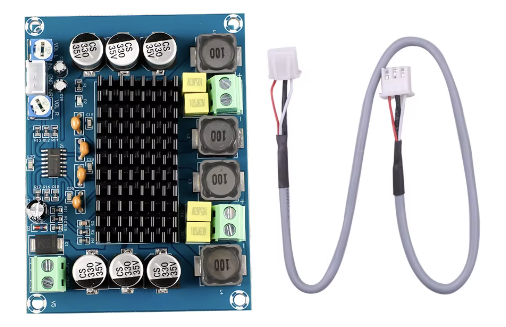

# Amplifier

The amplifier is the one I use daily on my desk and at events. I did not design the board but did make enclosure and wiring as well as unsured all specifications matched. 

{width="400"}

## Speaker System Amplifier for Game Night

I found 2 desktop speakers outside my apartment while walking the dog and wanted to get them to work. 

So, I decided to look up how speakers work, getting deep into passive vs. active speakers, amplifiers, recifievers, digital vs. analog audio, etc, etc. 

For simplicity sake, I could have just bought a integrated amplifier, but those were more than my budget rolling around $30 for the cheapest models on Amazon. So I found a <$2 amp from [aliexpress](https://www.aliexpress.us/item/3256804913221986.html?gatewayAdapt=glo2usa). 

I went to the Capitol hill tool library and sorted through their bins of old laptop chargers and found one that works for the speaker model I found outside. I also got some cables to splice and solder to connect to power supply to plug into the purchased amplifier.

The solder came from Pat, who gave it to me for burning wood at the wood carving crafts night I hosted. 

Currently using twist on cable connectors to connect wires. 

The left audio cable from the 3.5 jack that i plug into the computer doesn't work anymore (probably bent it too much). So I have both the left/right audio coming from the right audio output of the computer. I use accessibility settings to set the output to be mono instead of stereo so you hear all acoustics still.

## Current Progress

Working on building an enclosure for the amplifier. 

- I've broken the knob to adjust the volume for the right speaker
- Using polycarb for $1 from tapplastics scrap plastics bin out in Bellevue, WA. 

## Amp Specs

**Amp Name:** # 1PCS DC12-26V 2x120W Dual Channel Digital Stereo Audio Power Amplifier Board High Power CS8673 DIY 240W Amplificador Sound Board

- Model #: CS8673 Digital Audio Power Amplifier Board
- Working Voltage: DC12-26V
- Channels: 2
- Maximum Power Per Channel: - 101-130W
- Output power: 120x2W MAX
- DC12V: 2x50W  
- DC24V: 2x120W - 240/24 = 10amps
- Signal to noise ratio: 100db
- Size; 92x68x16mm
- 3P audio input

