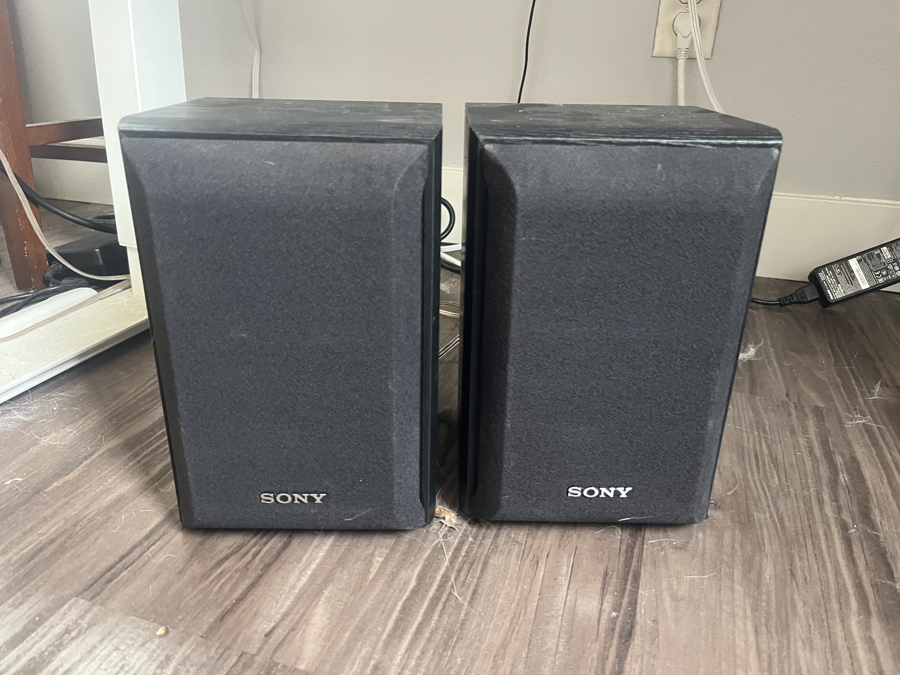
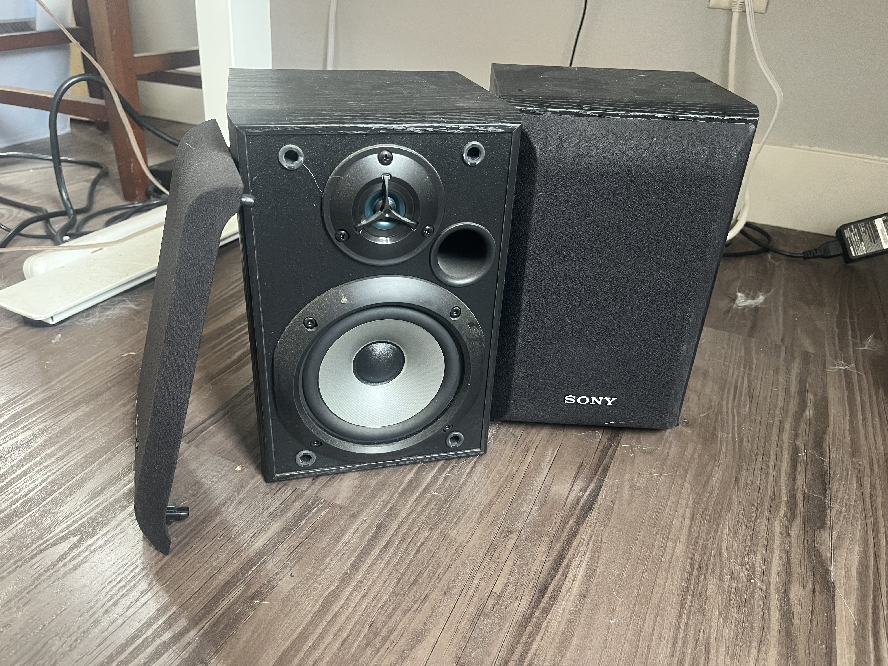

### Sony Bookshelf Speakers

- Model: SS-B1000
- Speaker System
- Rated Impedance: 8 ohms
- Magnetically shielded type
- Maximum Input Power: 120 W
- Serial NO: 9356260
- Made in Malasia
- TV's have a 3.5mm audio output on the back

{width="400}
{width="400}

Specs:
- https://electronics.woot.com/offers/your-choice-of-sony-speakers
- 5.25" Newly Developed H.O.P Cone Woofer
- 1" Nano Fine® Balanced Dome Tweeter
- Bass Driver(s): Yes (Enhanced H.O.P. Cone)
- Sound Reproduction to 50kHz (for High Resolution Audio)
- 120W Maximum Input Power
- Frequency Response 80-50kHz
- Sensitivity: 87 dB
- Speaker Terminal Type: Push Type
- Tweeter Size: 1" (2.5 cm)
- Woofer Size(s): 5 1/4" (13cm)

Dimensions:
- Dimensions (Approx): 6 11/16 x 10 1/16 x 7 1/16" (400 x 170 x 216mm) each
- Weight (Approx): 6 lb, 6 oz (2.9kg) each

CNET REVIEW: https://www.cnet.com/reviews/sony-ss-b1000-review/

[Reddit discussion on how to power](https://www.reddit.com/r/BudgetAudiophile/comments/177j4kz/no_idea_how_to_hook_sony_ssb1000_speakers/)

- Little cheapo amp off of Temu for five bucks and hook it up to the speakers
- It has bluetooth so you can just connect your phone to it and away you go.
- Just search "Bluetooth Amp" on Temu or AliExpress or Ebay or Amazon.
- need a power supply which may not be included. It's similar to a phone charger but probably 12 volts, or maybe 24 volts

Frequency Response
- https://www.reddit.com/r/hometheater/comments/1ykfqp/sony_ssb1000_bookshelf_speaker_frequency_response/

Reddit - https://www.reddit.com/r/BudgetAudiophile/comments/6l11ey/beginner_help_sony_ssb1000_set_up/
- 3.5mm to RCA cable

Speaker Quality:
- 1" nano-fine balanced dome tweeter 
- 120-Watt maximum input power
- 80-50,000Hz frequency response
- 8 Ohms impedence

Subwoofer can be added anytime

Amps: (Recommended brands)
- McIntosh
- Mark Levinson
- Cambridge Audio
- Yamaha

Budget Amps:
- Emotiva
- Parasound

Shopping:
- https://www.amazon.com/s?k=amplifier+120w&i=electronics&rh=p_36%3A-3500&page=6&xpid=LxFgEl1WMkef-
- https://www.aliexpress.us/w/wholesale-amplifier-120w.html?spm=a2g0o.productlist.search.0 