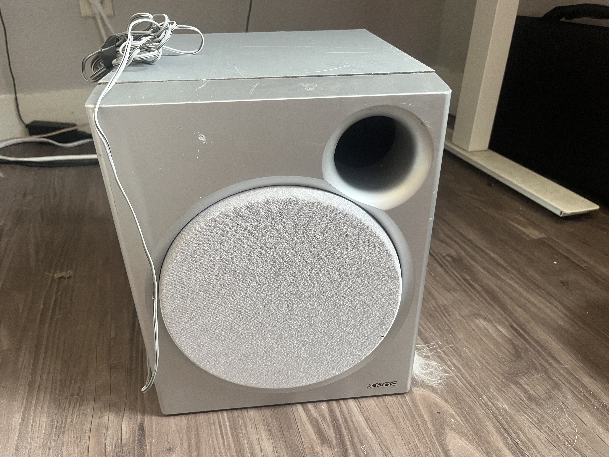
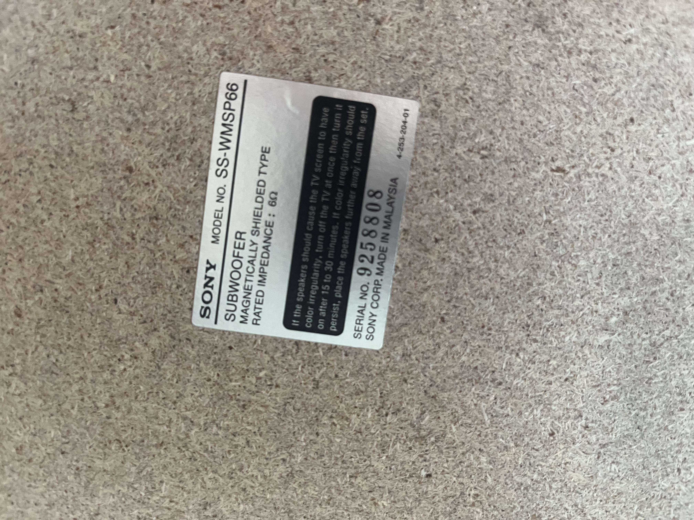

# Subwoofer

## Description

- Model No: SS-WMSP66
- Serial No: 9258808
- Magnetically Sheilded Type
- Rated Imepdance: 6 ohms
- Made in Malaysia

{width="400}
{width="400}

## Specs

With test amplifier at 70W @ 100Hz: THD = 10%
With test amplifier at 50W @ 100Hz: THD = 0.7%

- THD = Total Harmonic Distortion
- 10% is very noticible, but 0.7% is not.
- Mostly dependent on amplifier used not speaker...

| **THD Value** | **Sound Quality**                                          |
|---------------|------------------------------------------------------------|
| < 0.1%        | Excellent — often audiophile level                         |
| 0.1–0.5%      | Very good — common in high-quality consumer speakers       |
| 0.5–1.0%      | Acceptable — may be slightly audible at high volumes       |
| > 1.0%        | Noticeable distortion — especially in mids/highs           |

- Most people can’t hear distortion below 0.5% unless they’re trained or using reference tracks

## Citation

- [sony-subwoofer-data-sheet](https://www.sony.com/electronics/support/res/manuals/4254/42544611M.pdf)