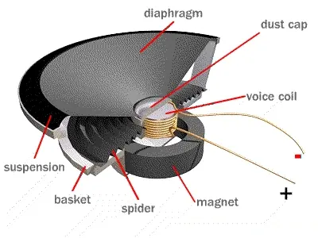
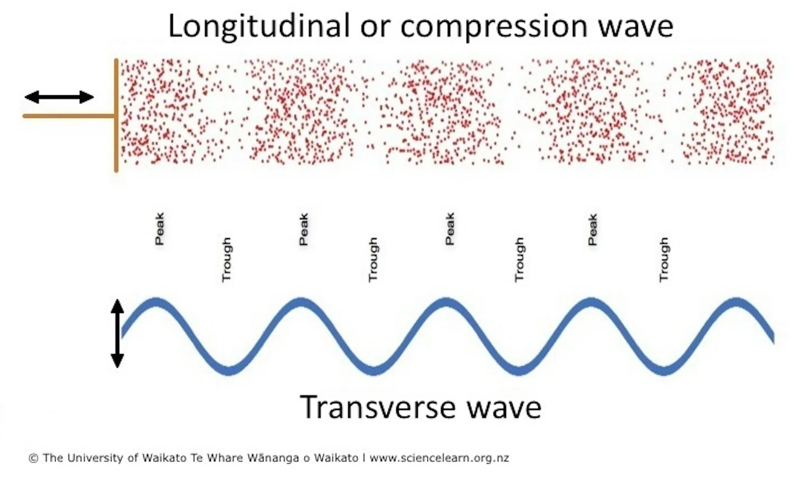
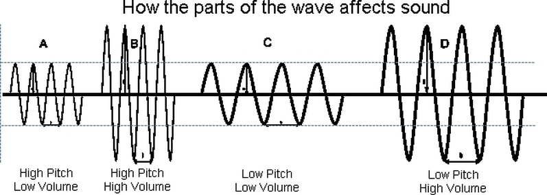

# Physics

Sound is a form of energy that is caused by the vibration of matter.

## Partical Physics

- Particles are pushed by a diaphram of a speaker driver. 
    - This movement is driven by a change in current (due to corresponding voltage change) spread into a coil (creating a solenoid) with a magnet on the backside. 
- The movement of the diaphram causes the particles to accumulate (compression) and spread out (rarefraction) at the corresponding frequency of the song/input.

{width="350"}

## Wave Physics

Although in real life, the wave should be representated as a compression wave, for mathematical simplicity sound is exclusively represented as a transverse wave (see below).

- Amplitude = Loudness = Volume
- Frequency = Pitch = Note = Tone

{width="550"}

An audio signal is a representation of sound. [Link](https://vhmsscience8.weebly.com/wave-machine-investigation.html)

1. by changing the level of electrical voltage for analog signals (loudness)
2. or by a series of binary numbers for digital signals

{width="550"}

**TL;DR:** Moving air creates sound primarily through the process of vibration. 

## More

**Vibration of Objects:** When an object vibrates (like a guitar string, vocal cords, or a speaker cone), it causes the surrounding air molecules to vibrate as well. These vibrations disturb the air, creating pressure waves.

**Pressure Waves:** As the vibrating object moves outward, it compresses the air molecules in front of it, creating regions of high pressure (compressions). When it moves back, it creates regions of low pressure (rarefactions). This alternating pattern of high and low pressure travels through the air, forming sound waves.

**Frequency and Pitch:** The frequency of the vibrations determines the pitch of the sound. Higher frequencies correspond to higher pitches, while lower frequencies correspond to lower pitches.

**Amplitude and Volume:** The amplitude of the vibrations (how far the object moves from its resting position) affects the loudness of the sound. Larger amplitudes produce louder sounds.

**Medium for Transmission:** Sound requires a medium (like air, water, or solids) to travel. In a vacuum, where there is no air, sound cannot propagate.

**TL;DR:** In summary, sound is produced when an object vibrates, creating pressure waves in the surrounding air, which we then perceive as sound.

## Citations

- [2814-sound-visualising-sound-waves](https://www.sciencelearn.org.nz/resources/2814-sound-visualising-sound-waves)
- [quora - Why-does-moving-air-create-sound](https://www.quora.com/Why-does-moving-air-create-sound)