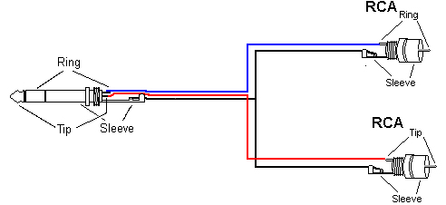

# Pioneer DJ

Founded under parent company Pioneer, starting in 1994, but became an independent company in 2014.

- Entails 60% of the DJ market
- From 2020, the company name is AlphaTheta Corporation

## Rekordbox

- In 2009, they released the computer based dj software, [Rekordbox](https://rekordbox.com/en/)
- [rekordbox introduction](https://cdn.rekordbox.com/files/20241213141709/rekordbox7.0.7_introduction_EN.pdf)
- [rekordbox manual](https://cdn.rekordbox.com/files/20250313121537/rekordbox7.1.0_manual_EN.pdf)
- [rekordbox installation and documentation](https://rekordbox.com/en/download/)

## DJ-Controller DDJ-400

https://www.pioneerdj.com/en/product/controller/ddj-400/black/overview/

{ width="500" }

{ width="500" }

{ width="500" }
d

## Speaker Wirirng 

https://www.mediacollege.com/audio/connection/jack-stereo-rca-2.html

Ground/Tip to outer side and tips are right/left

## Citations

- https://en.wikipedia.org/wiki/Pioneer_DJ