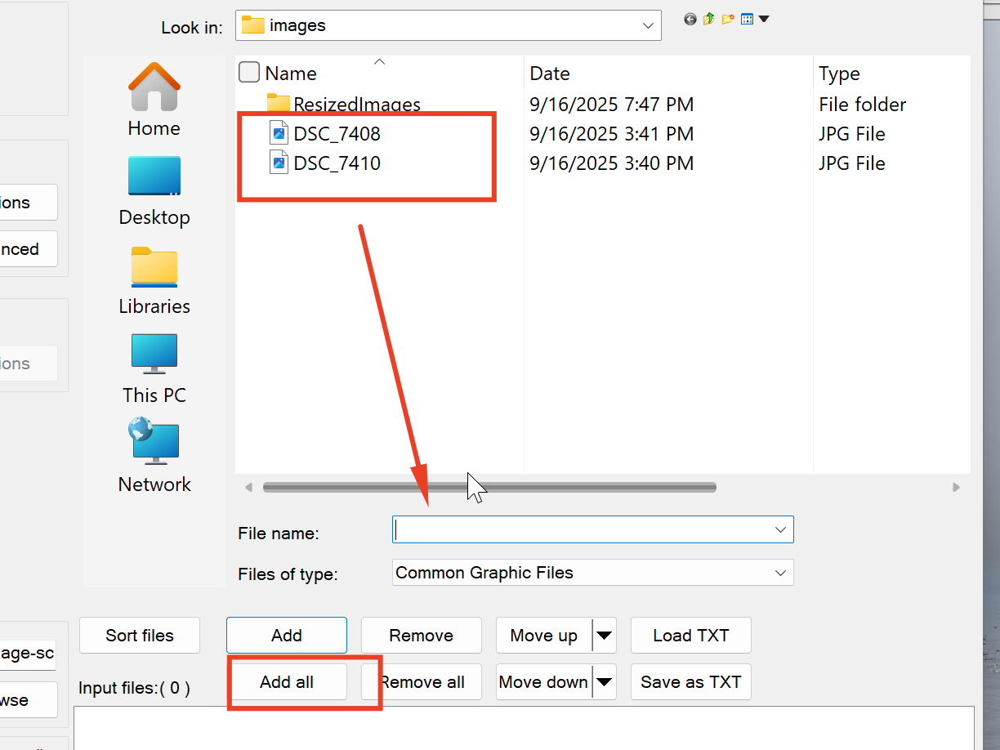
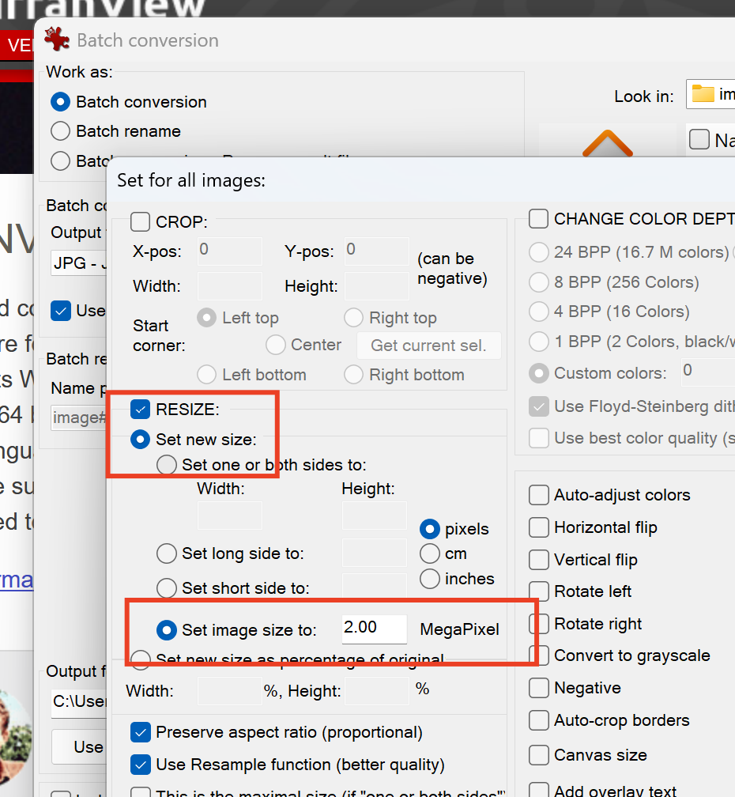
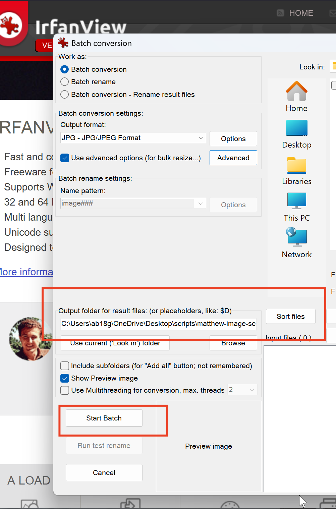

# Photo Resizing on Windows

Works for windows 11 arm64 and prior:

## 1. Install software

- [https://www.irfanview.com/](https://www.irfanview.com/)

## 2. Select batch conversion option

{width="400"}

## 3. Select images you want to convert

{width="400"}

## 4. Click Advanced Options

{width="400"}

## 5. Set image mp size you want for new images

{width="400"}

## 6. Select destination folder and run batch

{width="400"}