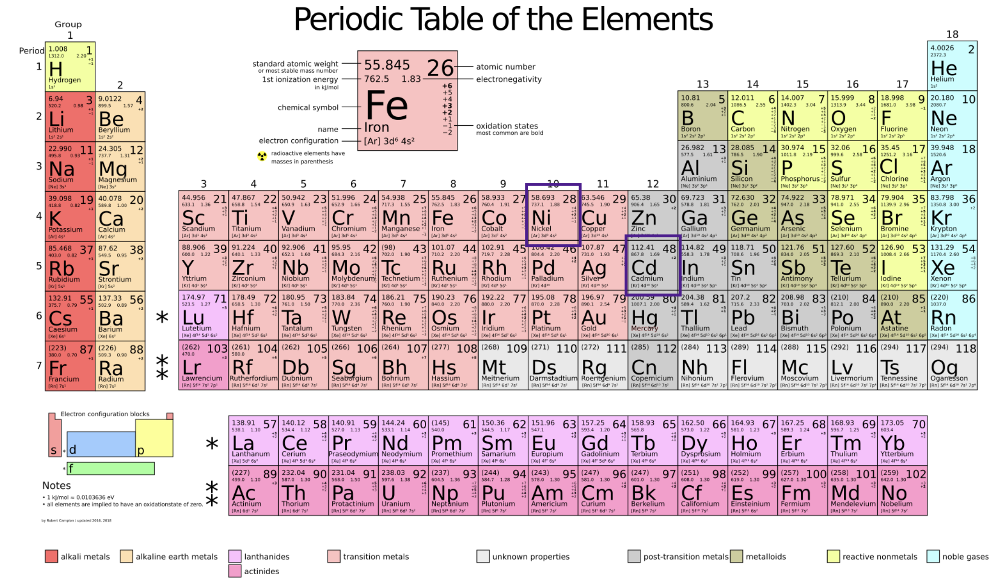

# Nickel Cadmium

A type of rechargeable battery using *nickel oxide hydroxide* and *metallic cadmium* as electrodes.

The significant advantage is the ability to deliver practically their full rated capacity at high discharge rates.

However, they have been largely superseded by lithium polymer (LiPo) and lithium iron phosphate (LiFe) batteries for high discharge with higher energy densities.



## Physics

The terminal voltage during discharge of around 1.2 volts which decreases little until nearly the end of discharge.

- This is lower than the 1.5 V of alkaline and zinc–carbon primary cells, so cannot always swap, but most devices account for lower voltages due to the higher discharge.

The maximum electromotive force offered by a Ni–Cd cell is 1.3 V. 
- Voltage is not the same as emf. Voltage is the potential difference between two points in a circuit, whereas emf is energy provided from power source (exists even in open circuit). Ex: A 1.5V battery has an EMF of 1.5V.

```
V=ε−Ir , voltage is emf minus back-emf
```


## Citations

- https://en.wikipedia.org/wiki/Nickel%E2%80%93cadmium_battery
- https://commons.wikimedia.org/wiki/File:Periodic_table_large.svg