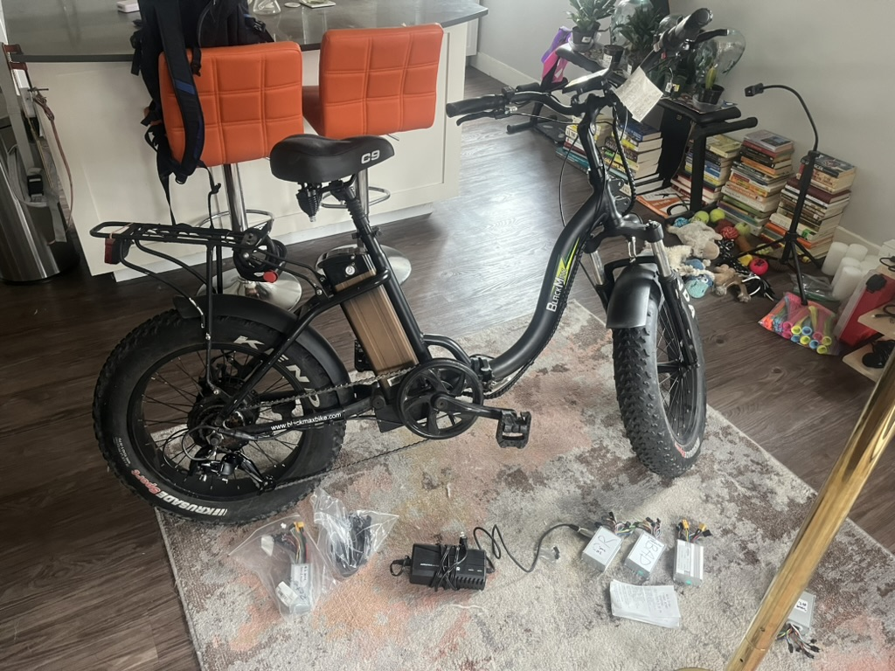

#  Black Max San Juan Step Through (B1k) 

{width="400"}

## Wayback Machine URL links

- [san juan step thru](https://web.archive.org/web/20201124094111/https://blackmaxbike.com/products/san-juan-step-thru)
- [san juan step thru t-handlebar](https://web.archive.org/web/20200929005225/https://blackmaxbike.com/collections/all-bikes/products/san-juan-step-thru-t-handlebar)

## Brand Overview

Seems like they existed for roughly 2 years from start of 2019 to end of 2020.

- Website offline now
    - [https://blackmaxbike.com](https://blackmaxbike.com)
    - [https://blackmaxmarysville.com](https://blackmaxmarysville.com)
- Social
    - [facebook](https://www.facebook.com/profile.php?id=100066483199523)
    - [instagram](https://www.instagram.com/blackmaxbikes/)
- ytb
    - [assembly, how to remove battery](https://www.youtube.com/watch?v=xGES5GdyVco)
    - [ebike review](https://www.youtube.com/watch?v=znNVWR-reCg)

Similar bike just re-branded Frame

- [magnum bike](https://magnumbikes.com/products/premium-3-torque-low-step)
- [ytb - bike overview - Sep 28, 2022, premium 3](https://www.youtube.com/watch?v=lgq8EBfeOnA)
- $1,700

## Contract Overview

Contract from shop:

- [Arlington Velo Sport](https://www.arlingtonvelosport.com/) 
- [Google Maps](https://maps.app.goo.gl/bxTg5VygTNqCm83k6)
- Best times to come in: mon/wed 8a-8p

