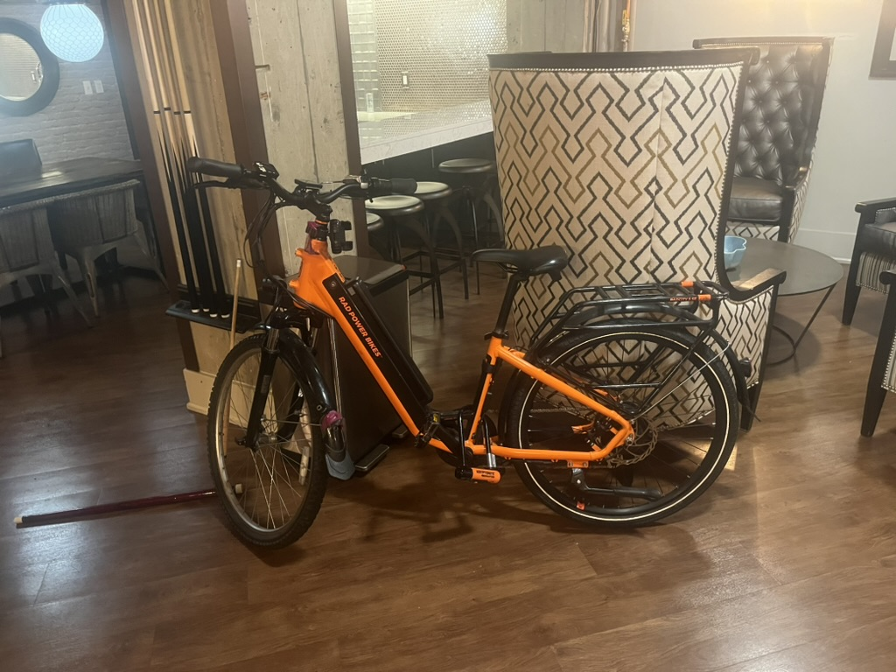

# Overview

<video autoplay width="320" height="240" controls playsinline loop>
   <source src="vids/breaking-ulock.mov"> 
   Your browser does not support the video tag.
</video>

In my apartment complex, I found this radbike locked to the leg of a shuffleboard table in the common room. Since it was 9pm on Christmas, I knew it had to be stolen, so me and some friends lifted the table and pulled the bike with the U-lock out from under the table. 

The bike was poorly locked and since it was locked to a table, we were able to just lift the table away from bike. 

Using [bikeindex](https://bikeindex.org/), I found the original owners by asking someone about their missing bike posting from 3 months prior. They were able to tell me the keycode that matched the bicycle and I was succesfully able to return the bicycle to their original owners. 

## Media

[RadCity™ 5 Plus Electric Commuter Bike](https://www.radpowerbikes.com/products/radcity-plus-electric-commuter-bike)

## Issues

However, the owner had already replaced the bicycle with a newer version of the bicycle. The stolen one also had pieces replaced and broken. 

1. The front wheel was replaced with a non-disk break wheel, so no front breaks! 
2. The motor wasn't turning on and giving error 21, so an electrical issue. 
3. The button pad was wripped off so you couldn't easily change the settings.

The cost of repair of the bike wasn't worth it and the original owners called me up and decided to just give me back the bike instead as a donation :).

And gave me a $50 finders gift :). 

The other docs are research into item replacements and fixes.

## Repair / Sold

1. Replaced controller with rad's upgraded replacement controller for $160
2. Replaced front wheel and brakes via bikery components
3. Sold ebike for $1,200 ($100 to Alex for helping replace front wheel)

## Citations

- https://bikerumor.com/rad-power-limited-edition-tiger-orange-radcity-5-ebike/

*With a claimed global user count of over 550,000, Rad Power Bikes say they’re America’s #1 eBike brand.