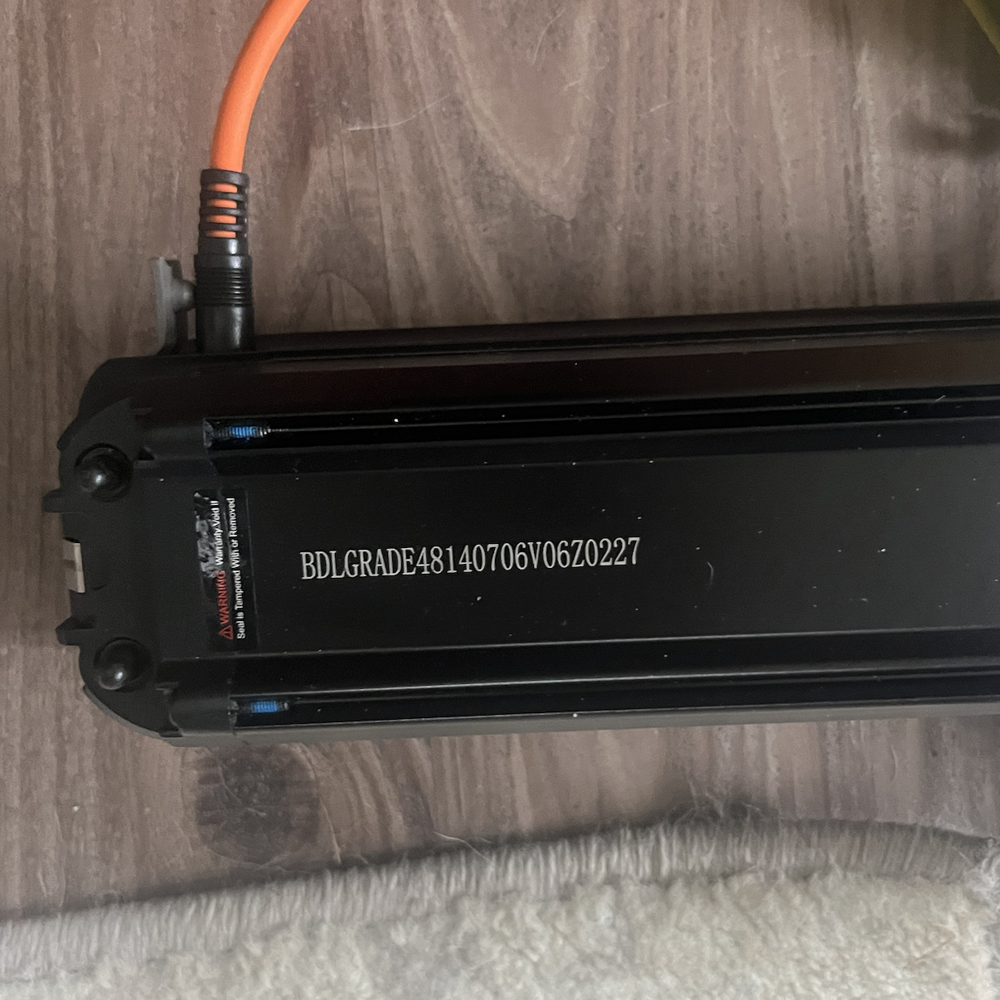

# Battery

- Rating: 48V, 14AH, 672 WH
- model: [rad-s1304R](https://www.radpowerbikes.com/products/rad-semi-integrated-battery-pack) 13INR19/65-4
- Manufacturer: PYTES, made in vietnam
- Weight: 7.6 lb (3.45 kg)

## Pins

- On output, center 3 pins are unused
- The big pins are positive and negative
- Electrical connector on the battery is a 5.5mm/2.1mm jack

## Cells

- Breakdown: 4 cells in parallel 13 in series 48V 14Ah.

## Charger

- Li-Ion chargers are constant current - constant voltage (CC/CV).
- Charger is 48V 2A

## Power
- Actual float voltage of the Rad charger is 54.6V
- Unsure how much current it [C rate]
- You can charge at a faster rate, but the batteries have a 5A fuse in the charge circuit, so that's a limit, and the higher the charge rate the less battery longevity

## Images

