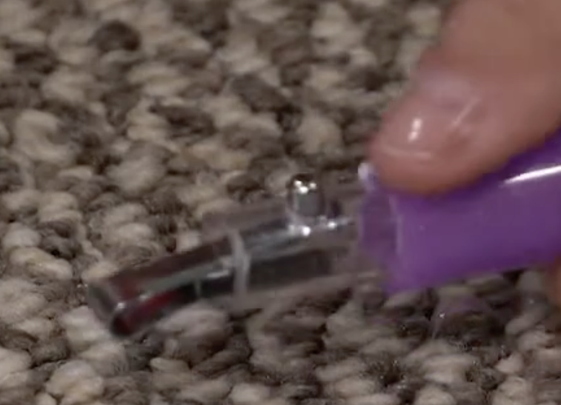

# Building a Basic Hula Hoop

[ytb hoopologie - how-to-make-a-polypro-hoop](https://www.youtube.com/watch?v=YW-MBIBQK-g&list=PL6q_IrhhxcB6BoLNs4MIzvt914U9PNF4p)

1. Measure tube length
2. Cut a quarter inch longer than measurement
3. Use boxcutter to clean up cut
4. Insert connector half way into 2 end of hoop
5. Drill hole into bottom side of hoop
5. Between 1/2 -> 3/4 inch on opposite side, drill hole for snap button with hoop connected together (cutting connector too)

{width="300"}
{width="300"}

## Materials for Custom Hoops

### Materials

- 10ft polypropylene [tubing](https://www.hoopologie.com/natural-clear-polypro-tubing)
- Connector bit (2in in length roughly)
- [snap buttons](https://www.hoopologie.com/tools-hardware)
- smaller locking tubing
- gaffer tape
- 1/8th or 3/32 inch, aluminum pop rivets (doesn't really matter the size, as long as long enough...)
- pop spring pin
- 1/8in drill bit + aluminum 1/8in pop rivets

### Cutting Options

- box cutter
- hack saw
- miter saw
- chop saw
- tube cutters

