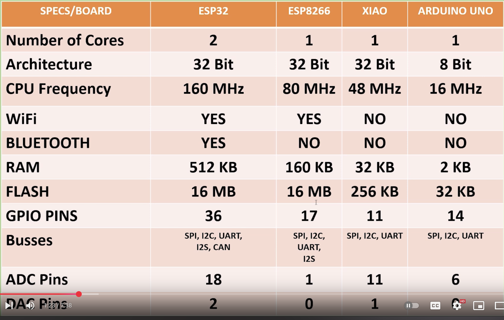

# Chips at home

- 4-digit 7-segment LED display module

STM8S003F3P6

- 8-bit Microcontrollers 
- MCU 8-bit MCU Value Line 16 MHz 8kb FL 128EE

**potentiometer (trimpot)**

- **Brightness control** – If this is part of a 4-digit LED module, adjusting it might change display intensity.

Arduino Uno

Seeed Studio XIAO SAMD21(Seeeduino XIAO) 

- Arduino Microcontroller 
- SAMD21 Cortex M0+ with Free Course
- $5.40

