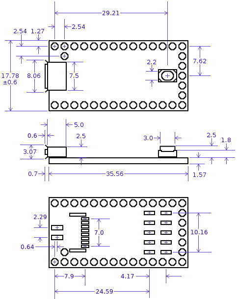
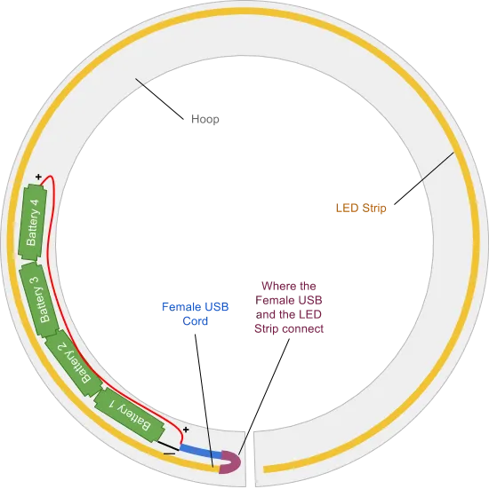

https://www.reddit.com/r/microcontrollers/comments/b9z71h/making_an_led_hulahoop_advice_on_smallest/

Attiny4

- sot-23 package and features at least two pwm outputs. 
- can vary its PWM to change brightness levels and create effects with the LEDs.

AP2502 

- sot-23 constant current driver 
- can supply up to 20mA of current to four channels

gyro chip

- Bosch BMX055. 
- There are newer ones on the market, but we've been using these for about 5 years. 
- running through NXP's sensor fusion toolbox, 
	- but I'm not doing much with its output right now 
	- most of it still uses a more simplistic scheme of my own that just has some filtering and a bit of trig.

Hyperion Hula Hoop (6 years ago)

- MK22FN1M0AVLH12s 
	- 1 MB flash, 128 KB RAM, 120 MHz Cortex-M4F in a 64-pin LQFP
- The 5/8" Hyperion Lite hoops run on a smaller MK22DX256VLH, also a Cortex-M4F but at 48 MHz with 256 KB flash and 64 KB RAM in a 48-pin LQFP. It'll just barely fit on a board small enough to go in a 5/8" tube if you rotate it 45 degrees

[NO!] Teensy boards small enough to go in a hoop unmodified that run a similar MK21DX256 or some such

Patterns are all stored as BMP images (24 MB of storage space, and it includes about 1500 patterns), and you can set up overlays and dynamic palettes, and link motion sensors to various parameters like pattern layer rotation or palette line, which makes for some really cool effects.

You can control them in real time with Art-Net, they'll sync with each other over UDP, there's a Basic script interpreter (doesn't do much yet but I'm working on it), command shell, telnet server, syslog support, a web interface served from the device itself that includes a pattern editor and visualizer.

I've just recently gotten the sensor fusion code working so they can get much better orientation data, and I've implemented a WebSocket server so I can stream data like that to the browser with low latency. I'm hoping the sensor fusion data will be sufficient to do some basic performance capture.

https://pritabread.medium.com/how-to-make-any-hoop-into-an-led-smart-hoop-for-less-than-30-55e32632d085

https://www.trustfire.com/products/trustfire-10440-350mah-battery

https://www.amazon.com/AmazonBasics-Rechargeable-Batteries-12-Pack-Pre-charged/dp/B007B9NXAC

Never allow a cell to dwell at 4.20V for more than a few hours.

Please note that not all Li-ion batteries charge to the voltage threshold of 4.20V/cell. Lithium iron phosphate typically charges to the cut-off voltage of 3.65V/cell and lithium-titanate to 2.85V/cell. Some Energy Cells may accept 4.30V/cell and higher.