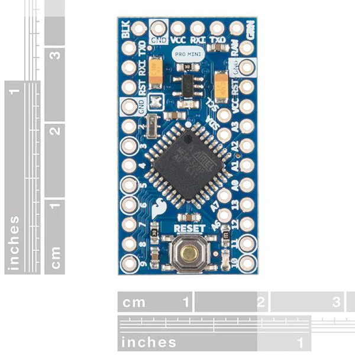

You want to use a constant current driver and not just a microcontroller.

- In order to maintain a constant level of brightness.

Use protoboard and sot-23 breakout boards to mount everything and that would give a lot of brightness in a small package.

Hoop-Trix [build your own hoop](https://hoop-trix.com/HoopTricks/HoopTricks/MakeLEDSmartHoops.html)

- generic led controller: [Ebay](https://www.ebay.com/itm/RGB-LED-light-strip-controller-24-key-IR-remote-DC-12-volt-9-V-battery-connector/254663330457?hash=item3b4b1e0a99:g:R1cAAOSwQBNfGigf)
- $4.50

Arduino Pro Mini

- https://docs.arduino.cc/retired/boards/arduino-pro-mini/
- saw off side pins
- rxi - recieve input, used for data in
- tx0 - used to transfer data to strip

Close to 1/2 in width:

https://www.seeedstudio.com/Seeed-XIAO-ESP32C3-p-5431.html

- $4.99
- Wi-Fi and Bluetooth 5.0

https://www.adafruit.com/product/3500

- $8.95

## Microcontrollers

- https://www.microchip.com/en-us/product/attiny4 **
- https://www.hackerstore.nl/Artikel/265
- atm328 controller pins
- https://docs.arduino.cc/retired/boards/arduino-duemilanove/
- https://www.nxp.com/part/MK20DX256VLH7
- https://forum.pjrc.com/index.php?threads/tiniest-teensy.33347/
