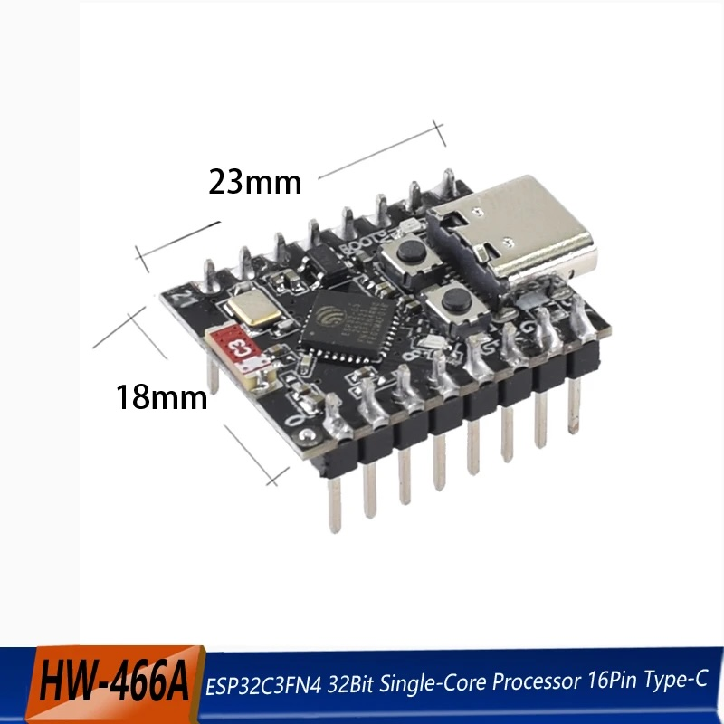
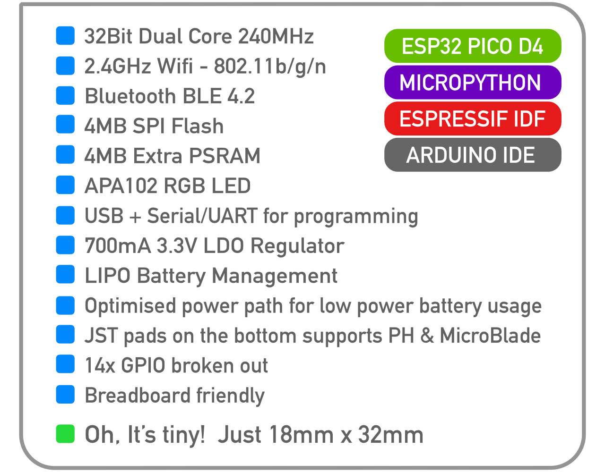

# ESP32

## ESP32 Versions with Release Years + Matter Support

| Chip         | Cores     | Architecture | Wi-Fi         | BLE        | Extras                          | Year | Notable Uses / Notes            | Matter Support |
|--------------|-----------|--------------|---------------|------------|----------------------------------|------|----------------------------------|----------------|
| **ESP32**     | 2× Xtensa LX6 | Xtensa      | ✅ 2.4 GHz     | ✅ Classic+LE | —                                | 2016 | The original ESP32, very popular | ❌ No           |
| **ESP32-S2**  | 1× Xtensa LX7 | Xtensa      | ✅ 2.4 GHz     | ❌           | USB-OTG, capacitive touch        | 2019 | Lower cost, no Bluetooth         | ❌ No           |
| **ESP32-S3**  | 2× Xtensa LX7 | Xtensa      | ✅ 2.4 GHz     | ✅ LE only    | USB-OTG, AI instructions         | 2021 | Better for ML, USB, peripherals  | ⚠️ Partial*    |
| **ESP32-C3**  | 1× RISC-V     | RISC-V      | ✅ 2.4 GHz     | ✅ LE only    | —                                | 2020 | Small, secure, efficient         | ⚠️ Partial*    |
| **ESP32-C6**  | 1× RISC-V     | RISC-V      | ✅ Wi-Fi 6     | ✅ LE only    | Thread + Zigbee support          | 2022 | Matter/Thread ready              | ✅ Yes          |
| **ESP32-C5**  | 1× RISC-V     | RISC-V      | ✅ Wi-Fi 6 (2.4 & 5 GHz) | ✅ LE only | —                                | 2023 | Rare, dual-band Wi-Fi            | ⚠️ Partial*    |
| **ESP32-H2**  | 1× RISC-V     | RISC-V      | ❌             | ✅ LE only    | Thread + Zigbee (no Wi-Fi)       | 2022 | BLE/Zigbee sensors, IoT nodes    | ✅ Yes (Thread/Zigbee) |
| **ESP32-P4**  | 2× RISC-V     | RISC-V      | ❌             | ❌           | USB, LCD, camera, cryptography   | 2023 | Designed as coprocessor or MCU   | ❌ No           |

\* **Partial** = Can run Matter over Wi-Fi or BLE, but lacks native Thread radio, so it may need a Thread Border Router or additional chip for full Matter-over-Thread support.

## Mini ESP32 Board

[ali - $5, mini](https://www.aliexpress.us/item/3256807599494788.html?mp=1&pdp_npi=5%40dis!USD!USD%2014.98!USD%204.72!!USD%204.67!!!%402101c59517539526147058271ef04c!12000044682986983!ct!US!2624340281!!1!0&gatewayAdapt=glo2usa)

- H2, C3, C6, S3 (different versions)

## Tiny Pico

- [https://www.tinypico.com/](https://www.tinypico.com/)

