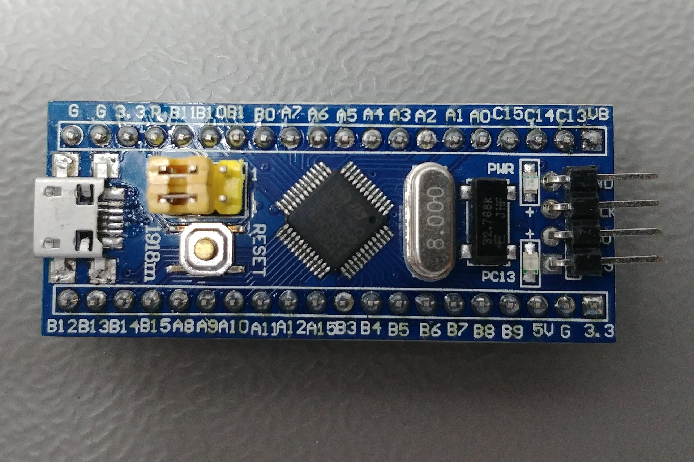
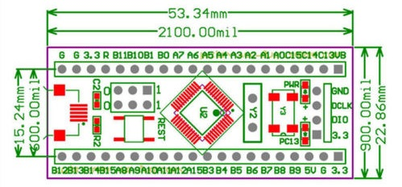

# STM32

## STM32 Blue Pill

- Microcontroller: STM32F103C8T6 (Mainstream, Performance)
- Core: Arm Cortex-M3
- Started developing in 2007
- Max. Clock Speed	72MHz
- FLASH: 64KiB
- SRAM: 20KiB

### Power

- Any +3.3V pin (+3.3V)
- Any +5V pin (+5V)
- USB connector (+5V)
- Input: +3.6V to +5.5V
- Output: +3.3V @ 300mA

{width="330"}
{width="330"}

## Description

Based on various 32-bit RISC ARM Cortex-M processing cores

## Citations

- [stm32 - wiki](https://en.wikipedia.org/wiki/STM32)
- [https://stm32-base.org/boards/STM32F103C8T6-Blue-Pill.html](https://stm32-base.org/boards/STM32F103C8T6-Blue-Pill.html)
- [https://www.st.com/en/microcontrollers-microprocessors/stm32-32-bit-arm-cortex-mcus.html](https://www.st.com/en/microcontrollers-microprocessors/stm32-32-bit-arm-cortex-mcus.html)
- [https://stm32-base.org/boards/STM32F103C8T6-Blue-Pill.html](https://stm32-base.org/boards/STM32F103C8T6-Blue-Pill.html)

## Links

- [https://www.txsemi.com/cn/index.html](https://www.txsemi.com/cn/index.html)
- [https://reversepcb.com/stm32f103c8t6/](https://reversepcb.com/stm32f103c8t6/)
- [https://electronics.stackexchange.com/questions/638490/how-can-i-use-stm32-blue-pill-with-external-power-source-like-battery-which-p](https://electronics.stackexchange.com/questions/638490/how-can-i-use-stm32-blue-pill-with-external-power-source-like-battery-which-p)
- [https://electronics.stackexchange.com/questions/348514/how-to-power-stm32f103c8t6-in-a-real-project](https://electronics.stackexchange.com/questions/348514/how-to-power-stm32f103c8t6-in-a-real-project)
- [https://www.st.com/en/microcontrollers-microprocessors/stm32-32-bit-arm-cortex-mcus.html](https://www.st.com/en/microcontrollers-microprocessors/stm32-32-bit-arm-cortex-mcus.html)
