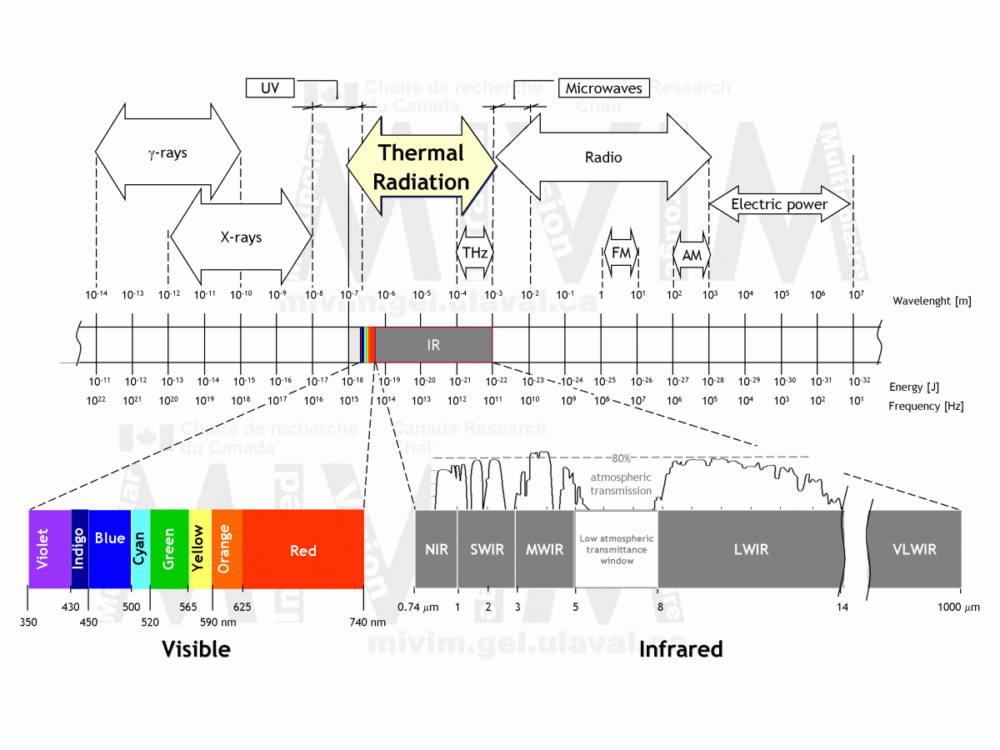

# Overview

The first remote controls detonated bombs in WWII.

Runs at 940nm

- Occasionally @ 850nm for security cameras
- Invisible to human eye but seen through cameras

- [arduino ir remote build](https://electronoobs.com/eng_arduino_tut34)

## Infrared Spectrum

Lower energy than visible light (longer wavelengths)

Range: 0.74 μm -> 1000 μm (10−6)

- NIR - near infrared
- SWIR - short-wave infrared
- MWIR - mid-wave infrared
- LWIR - long-wave infrared
- VLWIR - very-long-wave infrared

