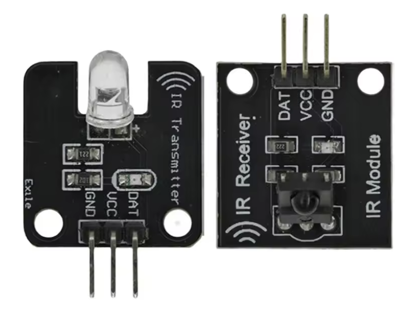

# RF Sensor

{width=300}

[aliexpress - 38Khz Infrared Receiver Sensor Module $1](https://www.aliexpress.us/item/3256807541900385.html?algo_exp_id=34315a2f-4415-493c-8afc-414554b3d054-0&pdp_ext_f=%7B%22order%22%3A%224037%22%2C%22eval%22%3A%221%22%7D&pdp_npi=4%40dis!USD!2.74!0.92!!!19.62!6.56!%402101c80017539453165726650e916c!12000042007299739!sea!US!2624340281!X&curPageLogUid=C6yzsYQfSP2M&utparam-url=scene%3Asearch%7Cquery_from%3A#nav-specification)

1. Infrared emission module:
    - Supply voltage: 5V
    - Working environment: -25~+85C
    - Storage temperature: - 30! 10OC
    - Wavelength: 940mm
    - Signal type: Digital signal
    - Infrared central wavelength: About 850nm-940nm
    - Infrared emission distance: About 1.3 m (5V 38khz)
    - Infrared emission Angle: About 20 degrees
    - Module weight: 1.5 g
    - Modules only store: 23.5 * 20.8 mm
    - Positioning hole size: 3mm

2. Infrared receiving module:
    - Supply voltage: 5V
    - Working environment: -25~+85C
    - Storage temperature: - 30! 100C
    - Carrier frequency: 940mm
    - Signal type: Digital signal
    - Infrared emission distance: About 10 meters
    - Infrared emission Angle: About 35 degrees
    - Module weight: 1.5 g
    - Modules only store: 23.5 * 20.8 mm
    - Positioning hole size: 3mm- 

Wiring instructions:

- DAT: indicates the digital output interface
- VCC: positive terminal of the 5VDC power supply
- GND: The negative pole of the 5VDC power supply

