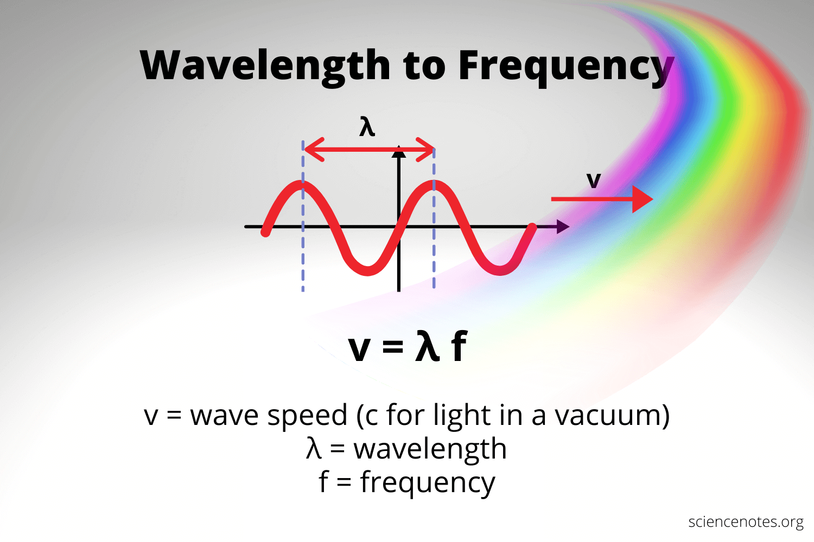
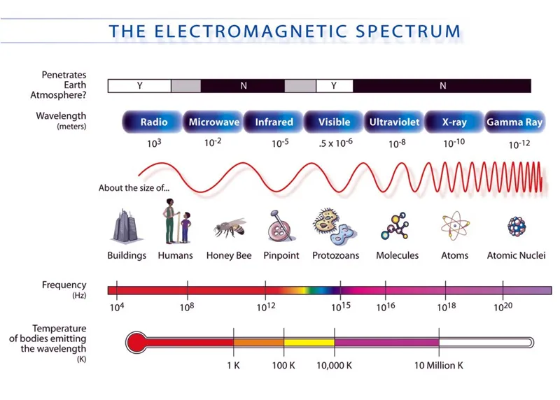

# Waves

A wave is a disturbance that propagates through a medium.

Water waves and sound waves are examples of mechanical waves, but light is not so easy to understand as a wave. Light waves are any waves in the electromagnetic spectrum.

## Radio Waves

Radiowaves are the light waves with the longest wavelength, so they have the least amount of energy in the spectrum. 

The frequency wavelength formula is given by

```markdown
            λ = 𝜈/f 
Wavelength(λ) = Velocity(𝜈) / Frequency(f) 
              - Greek letters
                - nu:     ν
                - lambda: λ
```

- where 𝜈 is the velocity of the waveform, if only the value of the frequency is given and the velocity is unknown, velocity of light in a vacuum is generally taken while calculating the wavelength of the wave. 

Speed of Light is ```3.00 x 10^8 m/s```

## Radio Wave Characteristics

#### Speed in medium

- Air is 99.97% of the speed of light.
- Coaxial cable or fiber optics are 30% to 70%, depending on the material.

#### Wavelength

- Range from a few millimeters to hundreds of hundreds of miles
- Visible light has wavelengths in the 400 to 700 nanometer range (1 × 10⁻⁹ m)
    - About 5,000 times shorter than the shortest wavelength radio waves.
- Radio waves oscillate at frequencies: 
    - few kilohertz to few terahertz (1 THz = 10^12 Hz)





| Type of Wave      | Wavelength                 | Frequency       | Examples                         |
|-------------------|----------------------------|-----------------|----------------------------------|
| **Radio**         | meters to kilometers       | kHz to GHz      | AM/FM radio, Wi-Fi, cell signals |
| **Microwaves**    | centimeters to millimeters | GHz             | Microwave ovens, radar           |
| **Infrared**      | micrometers (μm)           | THz             | TV remotes, thermal imaging      |
| **Visible light** | ~400–700 nanometers        | Hundreds of THz | Human vision                     |
| **Ultraviolet**   | ~10–400 nanometers         | Higher THz      | Sunburns, blacklights            |
| **X-rays**        | picometers to nanometers   | Even higher     | Medical imaging                  |
| **Gamma rays**    | <0.01 nanometers           | Highest         | Radioactive decay, cosmic rays   |


### Citations

- https://scied.ucar.edu/learning-zone/atmosphere/radio-waves
- https://physics.info/waves/

### Image Citations

- https://inspiritvr.com/wavelength-and-frequency-study-guide/
