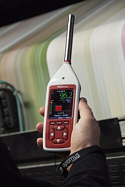

# Measurement

Sound level meter 

- measures acoustics, generally a hand-held instrument with just a microphone...
- generally condenser microphone for stability/reliability
- diaphram responds to change in air pressure (pascals) caused by sound waves and is converted to a voltage reading

Decibels (dB) is usually logarithmic represntation of sound pressure with 0 dB SPL equal to 20 micropascals. 

However, the reading from a sound level meter does not correlate well to human-perceived loudness, which is better measured by a loudness meter.

## Software

iphone app

- https://www.cdc.gov/niosh/noise/about/app.html

computer

- https://www.audacityteam.org/
- https://www.roomeqwizard.com/

## Hardware

- https://www.amazon.com/Tadeto-Portable-Backlight-Weighted-Factories/dp/B09G6HLNVV
- 

## Citations

- https://en.wikipedia.org/wiki/Sound_level_meter
- https://www.amazon.com/Tadeto-Portable-Backlight-Weighted-Factories/dp/B09G6HLNVV