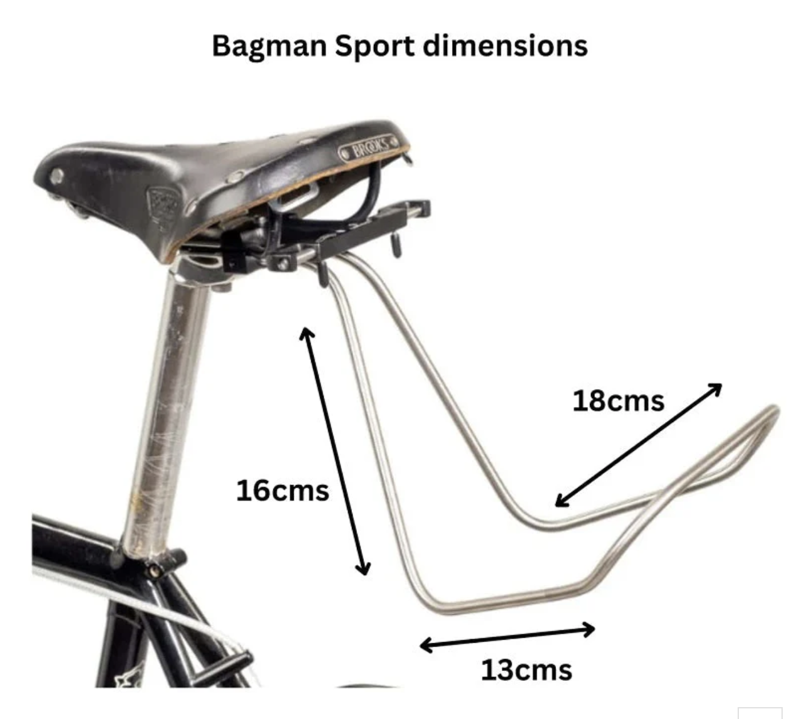

# Front Rack

[Saddle bag front rack](https://analogcycles.com/products/carradice-saddle-bag-support)

- Brand: Carradice
- Cost: $85

{width="300"}

[Saddle bag front rack dimensions](https://carradice.co.uk/products/bagman-sport-saddlebag-support-rack)

- Bagman Sport Saddlebag Support Rack
- $60 standard
- $120 quick release
- Size: 13x16x18 cm

{width="300"}

Alternative Rack

- https://ratkingframes.com/products/pre-order-rear-cradle

## Rods

- [Grainger list](https://www.grainger.com/category/raw-materials/metals/carbon-steel/carbon-steel-bars-rods-discs/inch-carbon-steel-rods-discs?attrs=Outside+Diameter%7C1%2F4+in&filters=attrs&searchQuery=steel+rod&sst=4&tv_optin=true)
- [Lowes List](https://www.lowes.com/search?searchTerm=steel%20rod&refinement=2511107848)
    -  [Hot rolled weldable steel rod](https://www.lowes.com/pd/Hillman-1-4-in-dia-x-6-ft-L-Plain-Hot-Rolled-Steel-Weldable-Solid-Round-Rod/3059271)
          -  1008 hot rolled steel
          -  it can be bent (its a "soft" grade).

## Tools

- [Wire bender](https://micromark.com/products/vise-mounted-wire-bender?keyword=Wire%20BENDER)
    - $12.95 USD
    - Comments say cant bend brass at even 1/8th inch?
- [Wire bender tutorial](https://www.youtube.com/watch?v=3QzrwPx9fNs)

## Build own wire bender

- [ytb short - DIY Wire Bender](https://youtube.com/shorts/j8UmDM5gWwU?si=xb-FGSEopVHPf17v)
- https://www.youtube.com/shorts/Fpa3Mh13rAg
- https://www.youtube.com/shorts/eGCl9RHhJU8
- https://www.youtube.com/watch?v=pmvEv2m-2Ak

## Saddle Rack Diagram

