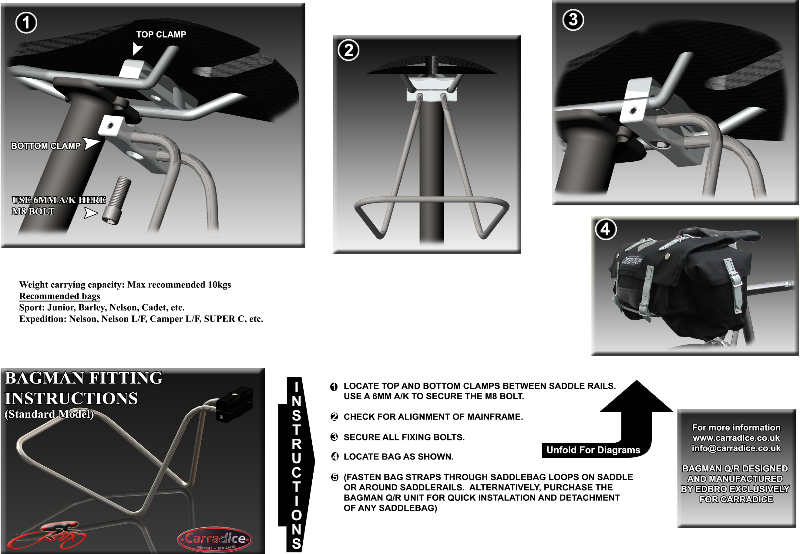

# Front Rack

## Build 

- For exact dimensions, you can use a soft metal and form design first 
    - Any soft copper/thin steel wire
- Length: roughly 80 cm or 2.5ft 
    - To be safe, get a 3 ft steel pole
- Diameter: 6mm, although 8mm can be used 
    - Kelly's saddle mount is 6mm ~1/4in
- Material: Stainless steel (won't corrode in water)
    - 304 stainless steel
    - Cheaper Alternative: Galvanized steel (zinc coating will rust but protect steel)
        - However, if dinked, steel can rust underneath
    - [SS - Tacoma screw - $13](https://www.tacomascrew.com/Catalog/fasteners/rods-and-studs/round-rod/304-stainless-steel/127-702-1)
    - [SS - Threaded rod Home Depot - $8](https://www.homedepot.com/p/Everbilt-1-4-in-x-3-ft-Stainless-Steel-Coarse-Threaded-Rod-7803/332735299)
    - [Zinc Plated, Home Depot - $6](https://www.homedepot.com/p/Everbilt-1-4-in-x-3-ft-Zinc-Plated-Steel-Solid-Round-Rod-1601/332734030)
    - [Online Metals, $5 ss rod, free cut and pickup :)](https://www.onlinemetals.com/en/buy/stainless-steel/0-25-stainless-round-bar-304-304l-annealed-cold-finish/pid/73)
- Clamps: [1/4in Wire Rope Clips, 2pc - Harbor Freight - $4](https://www.harborfreight.com/2-piece-1-4-quarter-inch-wire-rope-clips-93891.html)
    - NOTE: Most standard bike saddle rails have a diameter of 7 mm.
    - Or [Ace hardware Wire Rope - $7](https://www.acehardware.com/departments/hardware/chain-and-rope/rope-and-chain-accessories/77725)
    - [Mcmaster - $1](https://www.mcmaster.com/30325T63/)
    - [Aliexpress - $1.75](https://www.aliexpress.us/item/3256805937890967.html?mp=1&pdp_npi=5%40dis!USD!USD%201.75!USD%201.75!!USD%201.75!!!%402103146f17553379577858130e5ede!12000035861822735!ct!US!2624340281!!1!0&gatewayAdapt=glo2usa)
    - Amazon - [40/$20](https://www.amazon.com/gp/product/B0F1CW5LPL?psc=1) or [12/$7.50](https://www.amazon.com/gp/product/B0F1CW5LPL?psc=://www.amazon.com/gp/product/B09D79Y4M9)
    - [Tacoma Screw - $8](https://www.tacomascrew.com/Product/552-123)
    - [Granger - $10 each](https://www.grainger.com/product/DAYTON-Wire-Rope-U-Bolt-Clip-1-4-2VKH3)
- Instructional video: [YTB - DIY saddle bag support](https://youtu.be/dy4tRtDtaro)
    - He says 11kg/20lbs is limit bacause bends too much
    - Recommends to mount it to seatpost
- Heat bending: locally heated with a torch to make bending easir
    - Discolors it (rainbow/blue scale).
    - Reduces corrosion resistance in the heat-affected zone 
    - Can re-passivate or pickle it afterward
    - UNECESSARY
- Bending: bend radius ≥ 2× diameter (so ~12–16 mm)

[Saddle bag front rack](https://analogcycles.com/products/carradice-saddle-bag-support)

- Brand: Carradice
- Cost: $85
- Max load weight: 22lbs / 10kg
- [New link](https://builtbyswift.com/products/carridice-bagman-support)

{width="300"}

[Saddle bag front rack dimensions](https://carradice.co.uk/products/bagman-sport-saddlebag-support-rack)

- Bagman Sport Saddlebag Support Rack
- $60 standard
- $120 quick release
- Size: 13x16x18 cm

{width="300"}

Alternative Rack

- https://ratkingframes.com/products/pre-order-rear-cradle

## Rods

- [Grainger list](https://www.grainger.com/category/raw-materials/metals/carbon-steel/carbon-steel-bars-rods-discs/inch-carbon-steel-rods-discs?attrs=Outside+Diameter%7C1%2F4+in&filters=attrs&searchQuery=steel+rod&sst=4&tv_optin=true)
- [Lowes List](https://www.lowes.com/search?searchTerm=steel%20rod&refinement=2511107848)
    -  [Hot rolled weldable steel rod](https://www.lowes.com/pd/Hillman-1-4-in-dia-x-6-ft-L-Plain-Hot-Rolled-Steel-Weldable-Solid-Round-Rod/3059271)
          -  1008 hot rolled steel
          -  it can be bent (its a "soft" grade).

## Tools

- [Wire bender](https://micromark.com/products/vise-mounted-wire-bender?keyword=Wire%20BENDER)
    - $12.95 USD
    - Comments say cant bend brass at even 1/8th inch?
- [Wire bender tutorial](https://www.youtube.com/watch?v=3QzrwPx9fNs)

## Build own wire bender

- [ytb short - DIY Wire Bender](https://youtube.com/shorts/j8UmDM5gWwU?si=xb-FGSEopVHPf17v)
- https://www.youtube.com/shorts/Fpa3Mh13rAg
- https://www.youtube.com/shorts/eGCl9RHhJU8
- https://www.youtube.com/watch?v=pmvEv2m-2Ak

## Saddle Rack Diagram

