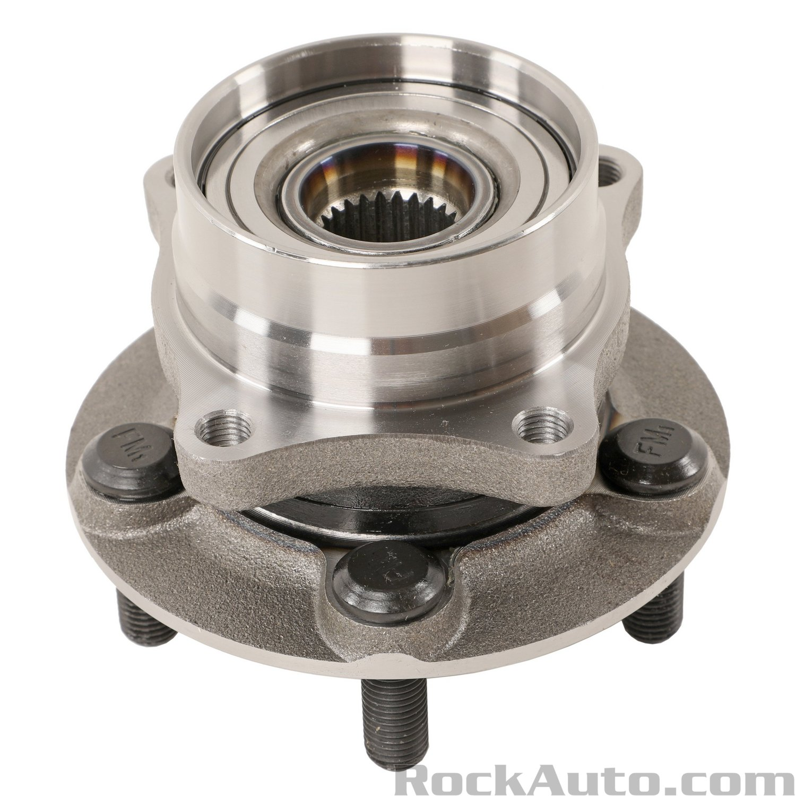

# Wheel Bearing Hub

## Vibration - Noise Issue 

Vibration and noise on passanger side front wheel for 6 months. 

- ABS error warning on obdii scan. The 
- Car will trigger engine error light and red exclamamtion after 30 minutes
- After an hour the car will have a long beep and parking brake warning light will be on
- Still rideable, one time couldn't go up steep hill and car wasn't allowing me to turn wheels with all lights and beep on

Now fixed and replaced: (w/ help of Tim Smith)

<video autoplay muted width="320" height="240" controls playsinline loop>
   <source src="../../media/bearing-hub-removal-h264.mp4"> 
   Your browser does not support the video tag.
</video>

  <a href="https://www.instagram.com/reel/DMh1VkPRk1I/" target="_blank" rel="noopener noreferrer">
    Watch this Reel on Instagram
  </a>

<b>Update after fix:</b> The wheel feels smooth on passenger's side but feels rough on drivers side now. (Passenger's side was replaced)

## Test Methods

### Shake Test: Identifying Play or Looseness

1. Lift your vehicle so the wheel is off the ground
2. Place your hands on the sides of the tire and try to shake the wheel
3. Now place your hands on the top and bottom of the tire and try to shake the wheel again
4. If you feel movement in both directions, you have play in your bearing and it needs to be replaced
5. **Note:** If you feel movement when shaking the wheel left to right, but not top to bottom, you could have a worn out tie rod end.
Similarly, if you have movement top to bottom, but not left to right, you may have a worn out ball joint.

⸻

### **Spin Test: Identifying Noise or Grinding**

1. Lift your vehicle so the wheel is off the ground and can spin freely.  
2. Spin the wheel, in either direction, and listen for a grinding or howling noise.  
3. If you hear a loud grinding or howling noise that increases with the speed of the wheel, you have a failed bearing that needs to be replaced.  
4. **Note:** It is best to test both front or both rear bearings at the same time so you can compare the difference between the two sides. If you have a failed bearing, there will be a noticeable difference in the amount of noise you hear during this test.

Source: [rockauto](https://www.rockauto.com/en/moreinfo.php?pk=3085863&cc=1441533&pt=1636&jsn=613)

## Purchasing

Wheel Bearing Hub Assembly

- $30 -> $90, unsure why varied in price
- $12 shipping
- [https://www.youtube.com/user/RockAutoLLC/videos](https://www.youtube.com/user/RockAutoLLC/videos)
- RockAuto - [MOOG 513265](https://www.rockauto.com/en/moreinfo.php?pk=1318766&cc=1441533&pt=1636&jsn=29&optionchoice=0-0-1-1&_nck=eAAcbbIvRAmM9UPnwkoz98Rg9O6qai1xHg%2FSnlS5%2By8%2B2APEBfTQuZCDb4ZosKrIRInMbZLer%2B5LDk%2Bzfi3Wt7kdVyPV8Q%2F3YR7JqQ7vLXLbY5y1K42FGoQXLd6viJch6DVmWuknqxIy%2BaF7HGIZxHA8KMxhP0DPhwBfLfmlR2SVHfDZlFCC6oaX2ijh%2BvLeBaSH4P3ZGNdxmI9ygajEyF6rXagfewY3tN3el1kTfu8B6DpnAh%2BgsjLj0jwGrbDkmHbLQ%2BhR5ZTCZJmui%2F%2FIyILQO9QUNFxbGZhwLLiOkN25%2F2XGgy4Mg10ztKdM%2By%2Fy)

{width="300"}
