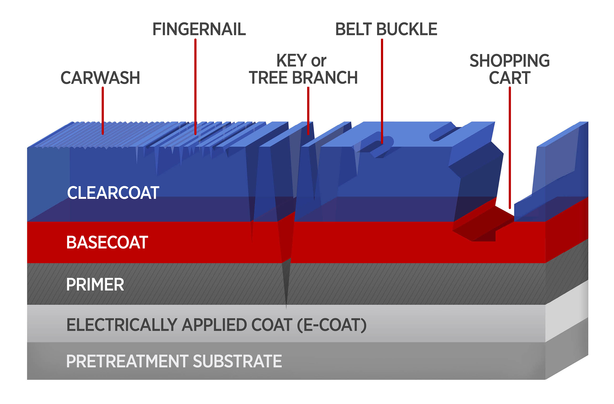

# Scratches

## Car paint layers

1. Clear Coat (40-50 microns)
2. Base Coat (10-25 microns) - car paint color
3. Primer (20-30 microns)
    - Bare metal/plastic/fiberglass doesn't hold paint well
    - Chemically bonds to surface, also sealing surface from rust
    1. Etching Primer
        - First layer (using contains mild acid, phosphoric acid) to "bite" into bare metal
        - Thin film, needs supplemental epoxy/urethane primer
        - Used for aluminum panels (generally higher end, not honda/toyotas)
    2. Epoxy Primer
        - Two parts: resin + hardener
        - Not as strong as etch as it mechancial adheres
        - Needs to be sanded to adhere
        - Also pretects from rust
        - 
    3. Urethane Primer
        - 2k version sprayed thick and sanded down
        - Used ontop of epoxy primer
        - 
4. 180-220 grit sanding on epoxy primer
5. Sealer (optional)
6. Basecoat
    - Color of car
7. Clearcoat
    - Protects from UV, scratches, chemicals
    - Gives gloss & depth

## How polish works

Car polish has fine abrasives

    - sponge just moves polish around
    - else sponge just moves on top of clear coat, possibly burning it
    - secondary, the polish acts as a lubrication to prevent burns
    - the pads get softer with higher grit to provide less force 

## Repair clear coat

Polishing pad + compound acts like super-fine sandpaper — it shaves down a microscopic layer of clear coat until the scratch is level with the surrounding surface

Compound is generally just a more aggressive version of liquid polisher, used like sandpaper

[ytb - buff w/ sponge pads](https://www.youtube.com/watch?v=xVUzn6rT5JU)

1. clean panel with car shampoo or soap to make sure grit does scratch surface again
2. buffing [sponge pads] for polishing/waxing
    - Orange (Coarse) -  Standard Grade Cutting Pad, Excellent For Enamels, Acrylics And Urethane.
    - Yellow & Blue (Medium) -  Polishing Pad, Final Cutting, Polishing Or Glazing Clear Coat Surfaces
    - White & Black (Extra Fine) - Finishing Pad, Provides A Rich Swirl-Free High Gloss Finish. 
- Held in place w/ velcro
- Damp polisher with water and run to remove excess
- Pour a circle of polishing compound on sponge
- Start on low on car to prevent throwing off the compound
- Increase speed when compound embedded into sponge
- Add some water if gets too dry
3. wipe with microfiber cloth
4. Spray with wax and rub microfiber cloth over it

Polisher - 650W (no need for more power)

Microfiber’s ultra-fine fibers lift dirt away instead of dragging it. Doesn't leave lint like cotton. Can hold 8x its weight in liquid.

- 300–400 GSM grams per square meter
- thick enough to be safe, but not so plush they soak up all your polish before wiping
- higher gsm is thiccer 

## Paint Touch Up

Purchaseable small liquid cartridges of paint specific for your car color

NOTE: Paint may not match if car is older as UV rays "damage" color of paint over time

- Additionally, the darker the paint, the lighter the touchup paint will be because the clearcoat darkens it
- However, due to differences in clear-coat, the darker touchup won't match darker cars

## Equipment

Drill Speed

- Low-speed polishing: 500–1500 RPM
- Medium-speed cutting/polishing: 1500–2500 RPM
- High-speed (pro-only, rotary polishers): 2500–4500+ RPM

Drill Torque

- polishing requires only ~50 in-lb (5–6 Nm)

[harbor frieght $15 cordless drill](https://www.harborfreight.com/12v-cordless-38-in-drill-kit-with-battery-and-charger-57366.html)
