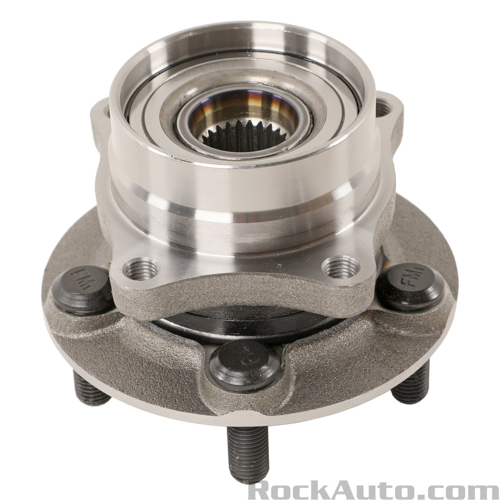

# Wheel Bearing Hub

Vibration and noise on passanger side front wheel for 6 months. 

- ABS error warning on obdii scan. The 
- Car will trigger engine error light and red exclamamtion after 30 minutes
- After an hour the car will have a long beep and parking brake warning light will be on
- Still rideable, one time couldn't go up steep hill and car wasn't allowing me to turn wheels with all lights and beep on

Now fixed and replaced: (w/ help of Tim Smith)

<video autoplay muted width="320" height="240" controls playsinline loop>
   <source src="../../media/bearing-hub-removal.mp4"> 
   Your browser does not support the video tag.
</video>
<blockquote class="instagram-media" data-instgrm-permalink="https://www.instagram.com/reel/DMh1VkPRk1I/" data-instgrm-version="14" style="background:#FFF; border:0; margin: 1px; max-width:320px; min-width:220px; padding:0; width:99.375%; width:-webkit-calc(100% - 2px); width:calc(100% - 2px);">
  <a href="https://www.instagram.com/reel/DMh1VkPRk1I/" target="_blank" rel="noopener">View this post on Instagram</a>
</blockquote>

## Vibration - Noise Issue 

- Source: [rockauto](https://www.rockauto.com/en/moreinfo.php?pk=3085863&cc=1441533&pt=1636&jsn=613)

## Purchasing

Wheel Bearing Hub Assembly

- $30 -> $90, unsure why varied in price
- $12 shipping
- [https://www.youtube.com/user/RockAutoLLC/videos](https://www.youtube.com/user/RockAutoLLC/videos)
i

- RockAuto - [MOOG 513265](https://www.rockauto.com/en/moreinfo.php?pk=1318766&cc=1441533&pt=1636&jsn=29&optionchoice=0-0-1-1&_nck=eAAcbbIvRAmM9UPnwkoz98Rg9O6qai1xHg%2FSnlS5%2By8%2B2APEBfTQuZCDb4ZosKrIRInMbZLer%2B5LDk%2Bzfi3Wt7kdVyPV8Q%2F3YR7JqQ7vLXLbY5y1K42FGoQXLd6viJch6DVmWuknqxIy%2BaF7HGIZxHA8KMxhP0DPhwBfLfmlR2SVHfDZlFCC6oaX2ijh%2BvLeBaSH4P3ZGNdxmI9ygajEyF6rXagfewY3tN3el1kTfu8B6DpnAh%2BgsjLj0jwGrbDkmHbLQ%2BhR5ZTCZJmui%2F%2FIyILQO9QUNFxbGZhwLLiOkN25%2F2XGgy4Mg10ztKdM%2By%2Fy)

{width="300"}