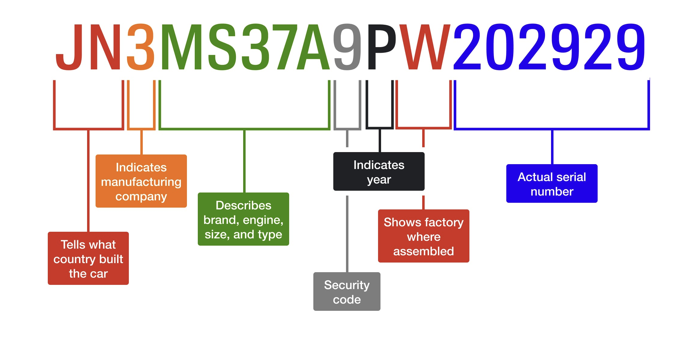

# My Car

I own a [prius](https://en.wikipedia.org/wiki/Toyota_Prius) 2008 Touring model. It was bought new from mom in 2008/9.

[Owner's manual](https://assets.sia.toyota.com/publications/en/om-s/OM08W1QG/pdf/2008_Prius_QRG_lr.pdf)

You can tell that it is a touring model because it has separate front fog lights and HID headlight bulbs (higher lumens than halogen). 

- VIN: JTDKB20U987769956
    - Country Built: J
    - Region Built: T
    - Manufacturer: D
    - Brand/Engine/Size/Type: KB20U
    - Security Code: 9
    - Year: 8
    - Assembly Factory: 7
    - Serial: 769956
- Year/Make/Model: 2008 Toyota Prius

{width="600"}

Most Info: [https://vincheck.info/](https://vincheck.info/)

- 2008 Toyota Prius Base / Standard / Touring
- Style / Body: Hatchback 4D
- Engine: 1.5L I4 FI Gas/Electric Hybrid
- Country of Assembly: Japan
- Engine: MFI HEV DOHC
- Plate Number: 6DCU698

Sites: vinrcl.safercar.gov, vindecoder.net, vincheck.info, autocheck.com, carfax.com, decodethis.com, detailedvehiclehistory.com 
