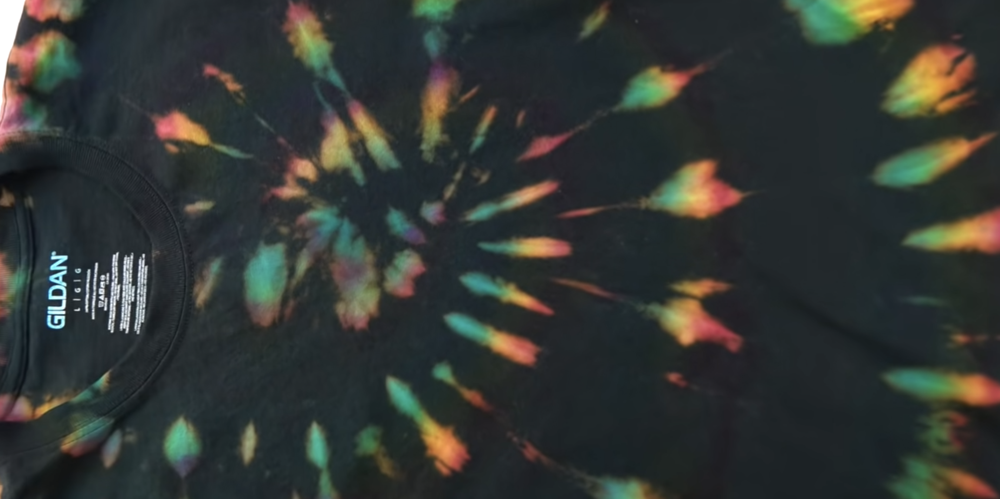

# How to Tie Dye Fabric

Methods:

- Spray bottle of bleach onto fabric
- Squeeze bottle alternative

Sprial method - used a rubber band to keep in spiral 

Material:

  - Bleach to stain clothes (1:1 ratio bleach:water)
  - Clorox bleach was used
  - Hydrogen Peroxide to neutralize bleach (1:10 w/ water)
  - Or (elizabeth said) you can just wash it to neutralize it
  - Cotten shirts bleached better
  - Rubber bands to hold cloth
  - Fabric dye into water for getting dye into shift after bleach
    - Just soaked shirt in fabric dye water mix
    - Poor result
  - Good result: Tye Dye squeeze bottle kit directly onto shirt
    - sit overnight

## Videos

[How To Tie Dye (WITH BLEACH)](https://www.youtube.com/watch?v=w-FXfvxdf2w)

## Citations

- https://en.wikipedia.org/wiki/Tie-dye

