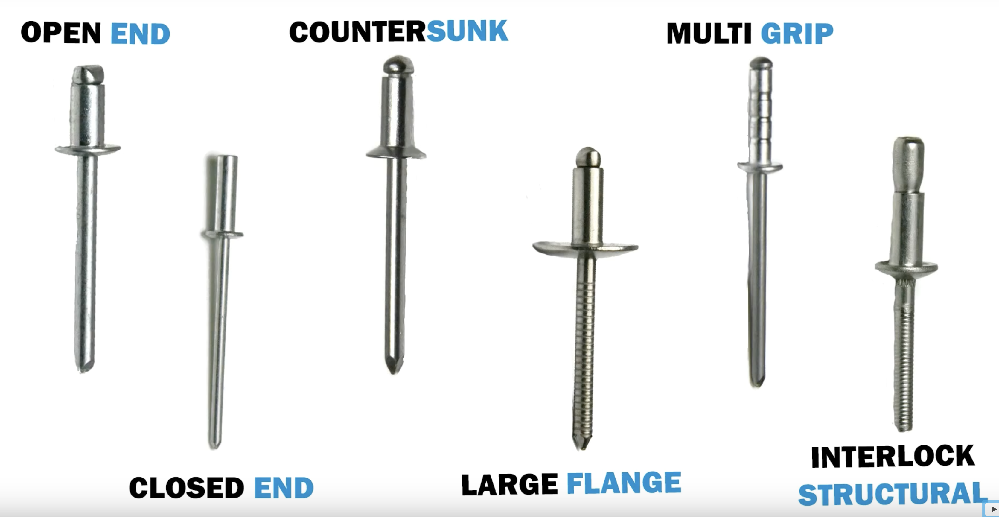

# Rivets

Mostly in aluminum or steel, where the steel is considered structural

[Blind pop rivet types](https://www.youtube.com/watch?v=1fzMZQCbHPc&t=26s)

## Purchaseable

- [https://www.acehardware.com/departments/tools/fastening-tools/rivets](https://www.acehardware.com/departments/tools/fastening-tools/rivets)
