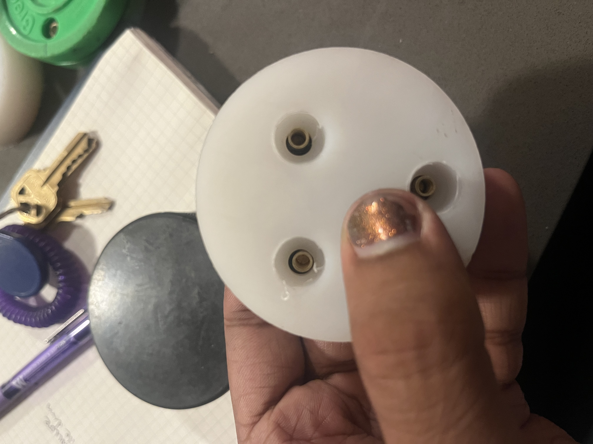

# Custom outdoor puck

{width="300"}
{width="300"}
{width="300"}
{width="300"}
{width="300"}
{width="300"}
{width="300"}

## Current Version

### Material

- 3in diameter - UHMW

### Attachment

- Hex binding bolts
- Blue/Red Loctite

### Spring force

- Stainless steel springs
- Or, lasercut foam

## Prior versions

- 2.5 in diameter - UHMW 
- Chicago brass screws
- Rubber bike inner tube spring force