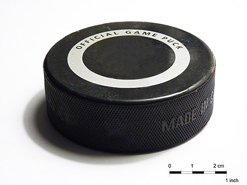

# Indoor Pucks

Short cylinder made of vulcanized rubber

A standard ice hockey puck is:

- Black
- 1 inch (25 mm) thick
- 3 inches (76 mm) in diameter
- Weighs between 5.5 and 6 ounces (156 and 170 g)
- Pucks are frozen before the game to reduce bouncing during play

Pucks are often marked with silkscreened team or league logos on one or both faces.

## Alternative pucks

- One of the most common is a blue, 4-ounce (110 g) puck that is used for training younger players who are not yet able to use a standard puck. Heavier 10-ounce (280 g) training pucks, typically reddish pink or reddish orange in colour, are also available for players looking to develop the strength of their shots or improve their stick handling skills
- Players looking to increase wrist strength often practice with steel pucks that weigh 2 pounds (910 g)
- White pucks are used for technical handling and goaltender practice. These are regulation size and weight, but made from white rubber. The colour blend in with the ice and rink and requires higher focus on the puck

Underwater hockey uses a type of puck that while similar in appearance to an ice hockey puck, differs in that it has a lead core weighing approximately 3 pounds (1.4 kg) within a teflon, plastic or rubber coating. This makes the puck dense enough to sink in a swimming pool, though it can be lofted during passes, while affording some protection to the pool tiles. 

- [https://en.wikipedia.org/wiki/Underwater_hockey](https://en.wikipedia.org/wiki/Underwater_hockey)

## Manufacturing

- Mix of natural rubber, antioxidants, bonding materials and other chemicals 
- to achieve a balance of hardness and resilience.
- Samples are then put into a machine that analyses if the rubber will harden at the temp
- pultrusion machine extrudes the rubber into long circular logs that are 3 inches (7.6 cm) in diameter and then cut into 1 inch (2.5 cm) thick pieces while still soft. 
- These pre-forms are then manually put into moulds that are the exact size of a finished puck.[15] 
- There are up to 200 mould cavities per moulding palette, capable of producing up to 5,000 pucks per week.
- The moulds are then compressed. 
- This compression may be done cold[6] or with the moulds heated to 300 °F (149 °C) for 18 minutes,[15] depending on the proprietary methods of the manufacturer. 
- They come out hard and then are allowed to sit for 24 hours. Each puck is manually cleaned with a trimmer machine to remove excess rubber. 
- The moulding process adds a diamond cross-hatch texture around the edge of the puck for improved friction between the stick and puck for better control and puck handling.[15]

## Videos

- [ytb - Canada 150: How hockey pucks are made - 2m](https://www.youtube.com/watch?v=gHLeoH5psNw)

## Citations

- [https://en.wikipedia.org/wiki/Hockey_puck](https://en.wikipedia.org/wiki/Hockey_puck)