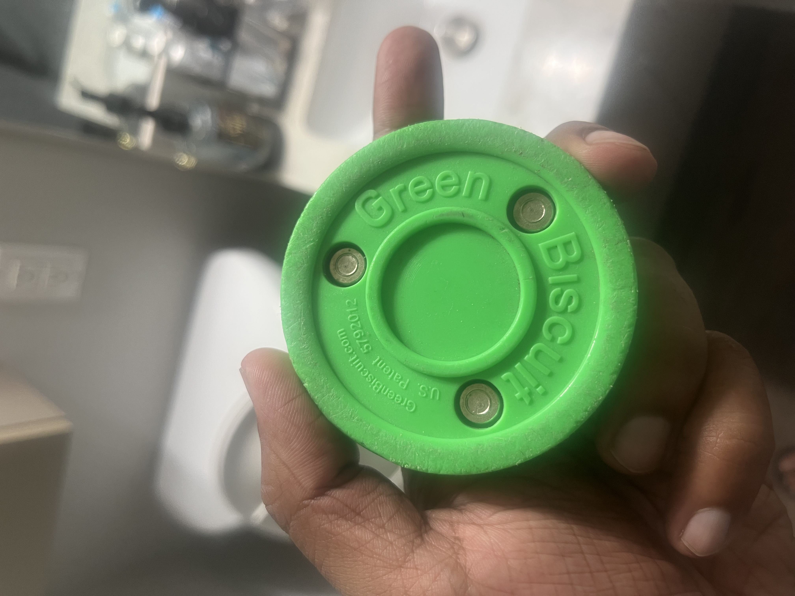
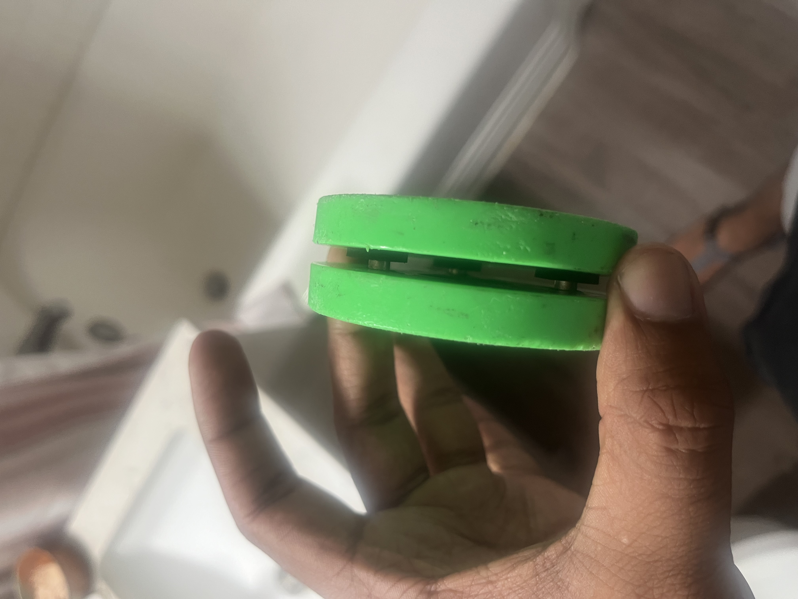

# Rivets

## Hockey Off-Ice Pucks
 
[Patent US5792012A](https://patents.google.com/patent/US5792012A/en)

[Green Biscuit](https://greenbiscuit.com/product/original-biscuit/) patent number written on their original green pucks: 
 
Filed in 1997; Expired in 2017

- three inches in diameter by one inch high (same as ice puck)
- improved performance by slightly increasing the diameter to 3.2 inches
    - and slightly reducing the height to 0.9 inches
- semi-tubular rivets are often the preferred rivet style for joints where movement is required (pivot points)
    - because the rivet material only swells at the tail. 
- many pucks use wheels/spheres to help roll but cost extra and grit get stuck in bearing

Patent Notes Extended

- solid puck 
    - will not travel far before it bounces, tumbles or starts rolling
    - Stick handling, moving the puck side to side with the stick. 
        - is impossible since the solid puck will not stay flat on the playing surface 
- When assembled the two halves are separated by a small distance, approximately an eighth of an inch.
- the spring or foam absorbs the sudden shock of hitting the imperfection
- When the puck lands back upon the playing surface the springs or foam help absorb the force of the landing. The springs or foam dampen every contact the puck has with the surface, which greatly reduces the incidents of bouncing, tumbling and rolling.
- A suitable foam material is polyurethane that can be depressed 25% with a force less than one pound per square inch.
- The spring constant of these springs is relatively light and the disks can be pushed together with only about five ounces of force
- The disks of all of the puck embodiments could be made with injection molded plastic such as high density polyethylene (HDPE). 
- Some ice hockey players may want a heavily weighted street puck to practice their shooting. Such a puck would be too heavy to use in a game.

{width="350"}
{width="350"}

#### Semi Tubular Rivets

Semi-tubular rivets (also known as tubular rivets) are essentially the same as solid rivets, but with a shallow hole at the tip, opposite the head. 

- This hole causes the tubular portion of the rivet (around the hole) to roll outward with force
- This reduces the amount of force needed for installation—tubular rivets require roughly ¼ the force of solid rivets.
- [ytb short - pop rivet inside tubular rivet](https://www.youtube.com/shorts/3JCqJCKxUUg)
- [ytb short - semitubular punch install](https://www.youtube.com/shorts/fKvkP3poVog)
- [ytb short - cross-section video punch](https://www.youtube.com/watch?v=I40ISVkF08s)

{width="280"}
{width="300"}

Held together by 3 rivets and foam spacer

- Size: 5mm diameter, 12mm length
- Foam Spacer: 2.5mm long, 14mm outer diameter
- Inner Spacing between pucks: 5mm
- Puck Diameter: 76mm
- Rivets distance from outer edge: 14mm
- Each puck thickness: 11mm
- Puck thickness countersink for rivets: 5.5mm
- Original Green cost: $14
- 4.6 oz

{width="280"}

## Purchase

### Rivets

#### Purchasable

- Arrow 3/16 in. D X 1/2 in. Aluminum Long Rivets Silver 50 pk
    - $10.49 - [Ace Hardware](https://www.acehardware.com/departments/tools/fastening-tools/rivets/2496925)
- (200Pcs) 3/16"x5/8" stainless steel blind pro Rivets,Steel handle and stainless steel mandrel 
    - 15% $16.99 [amazon](https://www.amazon.com/Wensilon-200Pcs-Aluminum-4-8X16mm-Mandrel/dp/B0C2KF5KL4)
- [harbor freight](https://www.harborfreight.com/90-piece-pom-rivet-assortment-67611.html)

### Rivet Guns

- [Harbor Freight - $20](https://www.harborfreight.com/45-piece-threaded-insert-riveter-kit-1210.html)
- [Harbor Freight - $10](https://www.harborfreight.com/11-in-swivel-head-hand-riveter-63396.html)
- [Harbor Freight - $17, weird design](https://www.harborfreight.com/hand-riveter-with-40-industrial-strength-poly-rivets-97757.html)

## Videos

- [Good rivet tutorial](https://www.youtube.com/watch?v=ZyWqWJKAV6k)
- [Punch method - rivets](https://www.youtube.com/watch?v=uh4oUxCzVbw)
    - https://www.youtube.com/shorts/fKvkP3poVog
- [ytb -  How To Use A Riveter or Rivet Gun - Ace Hardware - 4min](https://www.youtube.com/watch?v=yW3k3_sbkyc)
- [ytb - push rivet - 1min](https://www.youtube.com/watch?v=2uxTrkzf6SE)
- [ytb -  A Step-By-Step Guide on How to Use POP Rivets | Fasteners 101 - 14min](https://www.youtube.com/watch?v=1G8lGECOe1U) 
    -  Most in-depth video
- [Semi Tubular Rivet but use solid rivet to seal](https://www.youtube.com/shorts/ZOO4hiNArGI)
- [Semi Tubular Rivet diagram](https://www.youtube.com/watch?v=LKWtTZmXQ90)
- [Pop Rivet diagram](https://www.youtube.com/watch?v=9aoXmzdSf_I)

## Citations

- https://www.rivetsonline.com/rivets/semi-tubular-rivets

## Thoughts

- Can I just use rivets with threads and put a bolt through?
- https://www.youtube.com/shorts/RAVH4-h1cPA
- So then we can re-use half when half breaks