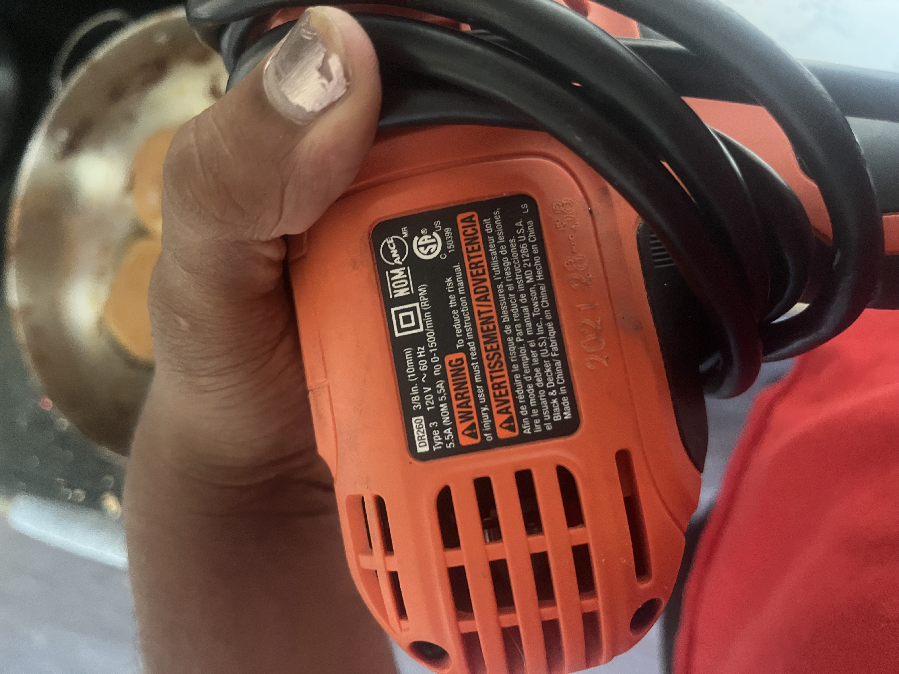

# Drill

{width="300"}
{width="300"}

## Purchase-able drill:

- [aliexpress cordless drill](https://www.aliexpress.us/item/3256807280799937.html?algo_exp_id=b408c4e7-c1db-46fc-b2a2-1b77df733d9f-17&pdp_ext_f=%7B%22order%22%3A%226%22%2C%22eval%22%3A%221%22%7D&pdp_npi=4%40dis!USD!66.43!25.91!!!475.18!185.36!%402101ea8c17543287808551902e34ff!12000041018495586!sea!US!2624340281!X&curPageLogUid=TWlUAOhdiyHR&utparam-url=scene%3Asearch%7Cquery_from%3A#nav-specification)
    - Rated Input Power: 130W
    - Torque: 28 Nm
    - No-Load Speed: 1600rpm
    - Rated Voltage: 21V
    - Chuck: 3/8in
    - $26

## Common Drill Motor Specs

Most common consumer-grade drills use motors like:

- 775 DC Motor (commonly seen in 12V–24V drills)
- Brushed, high RPM (~18,000 RPM no-load)
- Geared down inside the drill to ~1200–1800 RPM at the chuck
- Stall current: 15–60 A depending on voltage
- Motor resistance: ~0.2–1.0 Ω depending on design

'''V=I⋅R, @ stall current'''

'''τ=Kt⋅I, Kt is torque constant'''

## Speed vs Torque

High speed only makes job faster but doesn't really provide much else, and can be done with higher torque drills

- Soft material, for quickness, use high speed
- Hard material use higher torque

Drills generally have a gear 1 (high torque) or gear 2 (high speed) options

- So at stall torque of gear 2, you a factor less than high torque of gear 1
- aka: gear 2 has a lower mechanical advantage

When you increase the speed with no load, it stops spinning indefinately cause the back emf reduces operating voltage

- back emf occurs due to motor spinning

If you change the operating torque, but not the speed in a drill, you are reducing the applied voltage to motor

## Common Motors Used in Drills

---

### 1. Brushed DC Motors

**Types:**  

- 775 size motor (industrial standard)  
- 550 size motor (smaller, less powerful)  

**Typical Specs:**  

- Voltage: 12 V to 24 V (cordless), up to ~120 V DC (corded, rectified)  
- No-load speed: ~15,000–20,000 RPM (motor shaft)  
- Geared down to ~1200–1800 RPM at chuck  

**Torque Constant \(K_t\):**  

- Approximately **0.02 to 0.06 Nm/A**  
- Higher power motors have lower \(K_t\) (higher speed, less torque per amp)  

**Motor Winding Resistance:**  

- Ranges from **0.1 Ω to 1.0 Ω** depending on size and voltage rating  
- Larger motors → lower resistance (~0.1–0.3 Ω)  
- Smaller motors → higher resistance (~0.5–1.0 Ω)  

### 2. Brushless DC Motors (BLDC)

**Types:**  

- 3-phase brushless motors, custom windings for torque-speed profile  

**Typical Specs:**  

- Voltage: 18 V to 60 V (common cordless tool batteries)  
- No-load speed: 20,000+ RPM (motor shaft)  
- Gear reduction to desired chuck speed  

**Torque Constant \(K_t\):**  

- Typically **0.02 to 0.07 Nm/A**  
- More efficient with better torque curves than brushed m

## Motor Torque

- A 550 motor drawing 5 A would produce around 0.2 Nm of torque.

| Drill Type           | Voltage (Typical)           | Stall Torque Range (Nm) | Notes                                                                 |
|----------------------|-----------------------------|------------------------|-----------------------------------------------------------------------|
| **Corded Drills**      | 110-120 V AC (rectified DC) | 20 – 50 Nm             | Powerful, stable torque, heavier units                                |
| **Cordless Drills**    | 12 – 24 V DC (some up to 60V) | 10 – 40 Nm             | Portable, often brushless, torque varies with battery voltage & model |
| **Heavy-Duty Cordless**| 36 – 60 V DC                 | 40 – 90 Nm             | High torque for professional tools                                   |
| **Compact Cordless**   | 10.8 – 14.4 V DC             | 5 – 15 Nm              | Smaller, light-duty drills                                            |

| Drill Type           | Typical Gear Ratio Range | Notes                                                                                   |
|----------------------|-------------------------|-----------------------------------------------------------------------------------------|
| **Corded Drills**      | ~10:1 to 25:1           | Heavy-duty motors spinning fast, geared down to provide high torque and lower speed at chuck |
| **Cordless Drills**    | ~15:1 to 30:1           | Compact motors, often brushless, geared down to balance torque and battery efficiency   |
| **Heavy-Duty Cordless**| Up to 30:1 or higher    | For high torque applications, gearboxes provide strong torque multiplication           |
| **Compact Cordless**   | ~10:1 to 20:1           | Smaller gearboxes for lightweight drills, less torque multiplication                    |

| Current (A) | 550 Motor Torque (Nm) \(K_t=0.04\) | 775 Motor Torque (Nm) \(K_t=0.06\) |
|-------------|------------------------------------|------------------------------------|
| 2           | 0.08                               | 0.12                               |
| 5           | 0.20                               | 0.30                               |
| 10          | 0.40                               | 0.60                               |
| 15          | 0.60                               | 0.90                               |
| 20          | 0.80                               | 1.20                               |

## Stall Currents for 550 and 775 Motors

Stall current can be much higher than rated continuous current. A drill may briefly draw 15–30 A during stall or heavy load, increasing torque proportionally.

| Motor Model       | Rated Voltage | Terminal Resistance (Ω) | Stall Current (A) |
|-------------------|----------------|---------------------------|-------------------|
| **550 Motor**     | 12V            | ~0.5 – 0.8 Ω              | 15 – 24 A         |
| **775 Motor**     | 18V / 24V      | ~0.2 – 0.4 Ω              | 45 – 90 A         |

Larger gear ratios:

Reflected inertia grows with the square of the gear ratio:

- J_reflected = J_load × (gear ratio)^2
- T = J × α
- P = T × ω

High inertia requires higher torque to overcome, so requires more current draw

- may lead to running into stall current before accelerating, so no movement :(

