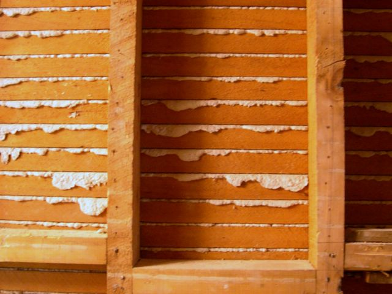

# Drywall

Also called plasterboard, dry lining, sheet rock...

- made of calcium sulfate dihydrate (gypsum) aka "plaster", also used as fertilizer 
- extruded between sheets of paper
- the plaster is mixed with paper or glass wool + plasticizer foaming agent + additives to reduce mildew, flammability, and water absorption

Colored drywall is moisture resistant (green/purple/blue) and is generally used in bathrooms

- Blue/purple is better than green cause it has antimold concrobium in itr
- Add redguard for more waterproofing 

Dry wall characteristics:

- invented in 1916, and became commonplace by 1950s
- Wood and plaster are heavier, more expensive, and might not be fire retardant
- the firerated drywall has fiberglass mixed in w/ the gypsum

## Stud finder

- works better if on edge across stud
    - else will find first edge, but overshoot the second edge
- studs are typically 16" apart
- Drywall panels are either 4 or 5.5ft, so you can measure 4 ft from bottom or corner for estimate
- studs are on one side of an electrical outlet
- you can happer a small nail above baseboard to see if resistance of stud
    - then repair with a slip of [caulking](https://www.youtube.com/shorts/BPEf6G5AxuY)

## Lath + Plaster

Used to use lath + plaster, where narrow strips of wood (lath) stacked with plaster

- plaster - made of lime+sand+water
- plaster also known as stucco if used on exterior instead of interior
    - or mortar if used w/ bricks/stone/concrete

Advantages/disadvantages:

- takes days/weeks to dry completely
- can crack overtime
- advantage for round corners or extra soundproofing over gypsum

{width="300"}

Sizes:

- Some use a 1/4" or 3/8" drywall on top of lath/paster 
- 1/4" is also good for curves (easily bendable by hand)

{width="300"}

## Common sizes

- 1/2 inch (used on walls comes in 4ft or 54inch width)
    - Comes in 8, 9, 10, 12 ft
- 5/8 inch (used on ceilings)
    - Also better for soundproofing

The thicker the drywall, the longer it can hold without requiring a stud/joist backing

## Repair

- [ytb - Lowe's how to repair drwall - 3min](https://www.youtube.com/watch?v=Fdy9uRvpI-E)
- [ytb - snap toggle removal](https://www.youtube.com/watch?v=cKixOhnRw8I&t=52s)

Purchaseable

- [amazon - 3m tube - $8](https://www.amazon.com/3M-Strength-Repair-Applicator-2-Pack/dp/B00UY39TZ0)
- [amazon - spackle 1 cup - $3](https://www.amazon.com/Red-Devil-0542-Lightweight-Spackling/dp/B0007M43WW)
- [amazon - repair kit - $10](https://www.amazon.com/Drywall-Spackle-Scraper-Surface-Solution/dp/B0D54PV3RW)

Quick Fixes:

- elmer's glue (PVA - polyvinyl acetate) + backing soda
- soak paper in glue and shove thru hole

Texture wall:

- Flick joint compound off of brush onto wall
- or, texture spray
- knockdown finish - flatten w/ drywall knife

Steps

1. Patch
2. Sanding
3. Primer
4. Paint

## Mounting onto drywall

{width="500"}

Dry wall anchors - [harbor freight - $4](https://www.harborfreight.com/search?q=drywall%20anchors)

- [ytb - how ot install anchors - 2min](https://www.youtube.com/watch?v=HRbOk5fyUB0)
- [ytb - how to hang on drywall - 4min](https://www.youtube.com/watch?v=T_k4WtidlY4)
- [amazon - 3m dry wall mounts](https://www.amazon.com/3M-Claw-Drywall-Picture-Hanger/dp/B09RN92NFC?geniuslink=true)
- [ytb - how plastic wall anchors work - short](https://www.youtube.com/shorts/BPEf6G5AxuY)

## Citations

- [ytb - What is drywall and why are there different thicknesses? - 4min](https://www.youtube.com/watch?v=01GzFacey28)
- [ytb - Types of drwall - 7min](https://www.youtube.com/watch?v=DHxR3i6Gu4c)
- [ytb - History of drywall](https://www.youtube.com/watch?v=B1mJsi4Px4A)
