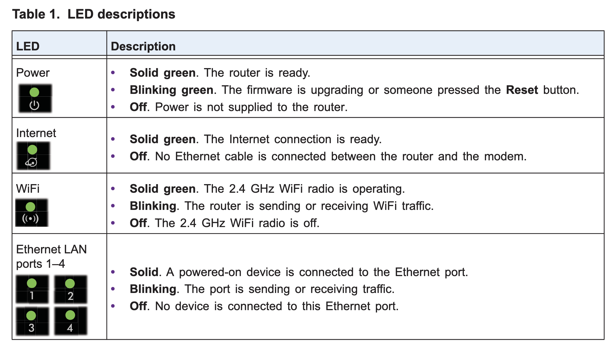

# Router

Device that forwards data packets between computer networks.

Routers can be built from standard computer parts but are mostly specialized purpose-built computers.

- Early routers used software-based forwarding, running on a CPU. 
- More sophisticated devices use application-specific integrated circuits (ASICs) to increase performance or add advanced filtering and firewall functionality. 

## Current Router

Netgear R6220 Router

Device Specs:

- CPU: MediaTek MT7621ST, 880 MHz
- RAM: 128 MB
- Flash: 128 MB NAND
- Wi-Fi: Dual-band (2.4 GHz b/g/n via MT7603EN, 5 GHz a/n/ac via MT7612EN)
- Ethernet: 4× LAN + 1× WAN (all Gigabit)
- USB: 1× USB 2.0
- Antennas: 2 external (non-removable)

More Specs: 

- $90
- https://www.amazon.com/NETGEAR-AC1200-External-Antennas-R6220/dp/B00QGOQ2BA
- https://www.netgear.com/support/product/r6220/
- AC1200 - 300+900Mbps† speeds
- For up to 20 devices and 1200 square foot coverage 
- 880MHz processor
- USB 2.0 port—Wirelessly access & share USB hard drive
- IEEE® 802.11 b/g/n 2.4GHz
- IEEE® 802.11 a/n/ac 5GHz
- Memory: 128 MB flash and 128 MB RAM
- WiFi transmitters/receivers (Tx/Rx) - 2x2 (2.4GHz) + 2x2 (5GHz)

Security

- Standards-based WiFi Security (802.11i, 128-bit AES encryption with PSK)
- Double firewall protection (SPI and NAT firewall)
- Denial-of-service (DoS) attack prevention
- Free custom URL using NETGEAR Dynamic DNS service

## OS - OpenWRT

- Supported since: OpenWrt 18.06.0
- https://firmware-selector.openwrt.org/?version=24.10.1&target=ramips%2Fmt7621&id=netgear_r6220
  

## Citations

- https://en.wikipedia.org/wiki/Router_(computing)
- https://www.amazon.com/NETGEAR-AC1200-External-Antennas-R6220/dp/B00QGOQ2BA
- https://www.netgear.com/support/product/r6220/
  