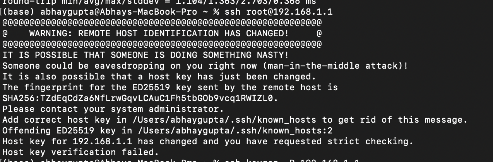

# Setup Router to OpenWRT

## Current status

Current status: Only power light on

- Routers is in recovery or failsafe mode
- Your computer won’t automatically get an IP from it.
- So if your Mac is waiting for an IP (via DHCP), and 
- the router doesn’t hand one out, they can’t talk to each other. 
- No IP = no ping, no SSH, no web UI.

## Set computer IP
Change the IP to a static IP:

- Router: ```192.168.1.1```
    - Default static IP in OpenWrt
- Your Mac: ```192.168.1.2```
    - Manually assigned so it's on the same subnet

Both devices are on the ```192.168.1.x``` subnet

- This allows direct communication between them — like SSH or ping — without needing DHCP or internet

Change PC's ethernet

- Set your PC's IP manually to ```192.168.1.2```, subnet ```255.255.255.0```.

## Bootmode

Get your router into bootmode/failsafemode:

- Power off router
- Press the reset button rapidly and power back on router
- If Internet and Wi-Fi LEDs are blinking alternately, you are in boot loop or incomplete boot

## Failsafe mode

Failsafe mode is a minimal rescue boot mode built into OpenWRT.

- The router is soft-bricked (e.g., you can't access web/SSH, but it’s not fully dead)
- Bad config locked you out
- LuCI or dropbear are misconfigured
- Startup scripts are broken

It lets you:

- Reset configurations (firstboot)
- Manually fix configs via command line
- Reboot clean and regain access

Steps to activate:

- Power off router
- Hold the WPS/Reset button (back of the router).
- Plug in power while still holding the button.
- Watch the Power LED:
    - Initially solid.
    - Then it should start blinking rapidly (not the slow blink it does during normal boot).
- Release the button as soon as it starts blinking fast.
- Wait 5–10 seconds.
- On your Mac, confirm IP address is still in 192.168.1.x range.

Then try:

```
ssh root@192.168.1.1
```

## Next steps

Still in bootmode

Then, soft-bricked beyond failsafe

## TFTP Recovery

TFTP, or Trivial File Transfer Protocol, is a communication protocol for transmitting or receiving files in a client-server application

- Netgear R6220 has TFTP recovery built in
- Re-flash the firmware (OpenWRT or stock) over Ethernet
- 192.168.1.10

```
cd /path/to/firmware.chk
tftp
tftp> connect 192.168.1.1
tftp> binary
tftp> put firmware.chk
```

